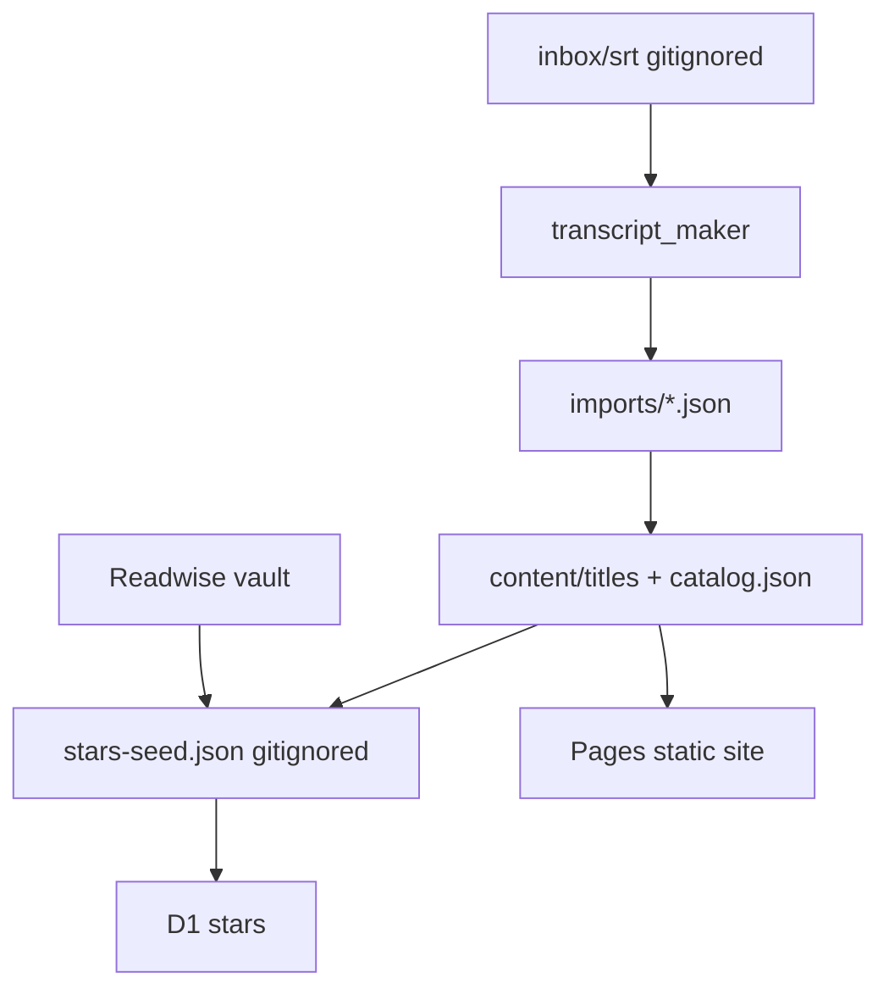

# Content ingest

Run this whole pipeline in one go unless the user asks to stop after a step.

## Procedure

1. **Detect new files.** List `inbox/srt/` (and named subfolders like `Simpsons_S5`). `batch:export` is **not recursive**. Compare filenames/titles to `content/catalog.json`. Skip anything already imported. Never re-import Payback, Inglourious Basterds, or other curated titles.

2. **Clean names.** Copy new files to a temp dir with titles like `Barbie.2023.eng.srt`. Release-group names leak into catalog titles.

3. **Convert** from sibling `../transcript_maker`:
   ```bash
   npm run batch:export -- <dir> --out ../textline-nextline/imports
   ```
   Skip tracks that are clearly incomplete (≲500 cues or starting ~20min in). `.sub` is supported.

4. **Import each NEW json only** (never `import:all` — that remaps `lineIndex` and breaks stars):
   ```bash
   npm run import -- imports/Barbie-2023.json
   ```

5. **Match Readwise** (vault is local; TV matches catalog episode names, not just Letterboxd):
   ```bash
   npm run content:queue -- --from inbox/letterboxd --vault "C:\Users\dasco\Documents\clocs\Readwise"
   ```

6. **Push stars** for `dascolin@gmail.com`. Preview, then write:
   ```bash
   npm run content:stars-push -- --email dascolin@gmail.com --remote --dry-run
   npm run content:stars-push -- --email dascolin@gmail.com --remote
   ```
   Skips `content/stars-protected.json` even with `--force`. Also skips any title that already has stars for this user. Add a title id to that file when the user starts curating it in the app.

7. **Report.** New title ids, cue counts, Readwise hits, D1 skip vs insert, and that **Pages deploy** is still required for new movies to appear on the site. Transcripts live in git; D1 is stars only.

## Where things live



| Store | What goes live |
| --- | --- |
| `content/titles` + `catalog.json` | Playable lines. Commit + Pages deploy. |
| `content/stars-protected.json` | Title ids seed-push must never touch. |
| D1 `stars` | `(title_id, line_index, player_id)` after `stars-push --remote`. |
| Pages | UI + baked catalog. New titles invisible until deploy. |

## Follow-up

Protected titles skip the **whole film** so Curate unstars stay gone. Later: tombstones on unstar, then merge `seed − tombstones`.
