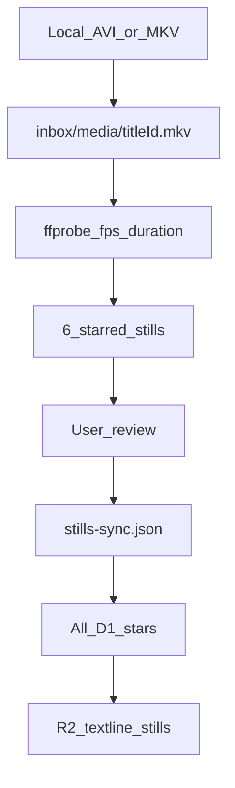

# Stills extract

Offline only. Movie files never leave the machine. **Stop after the starred handful** and wait for the user to eyeball frames. Do not batch all stars until they say the stills match.

## Procedure

1. **Match title to file.** Catalog `titleId` in `content/catalog.json`; `content/titles/{id}.json` must have `startMs`. Trust the **filename** (Empire is `Star Wars Episode V - The Empire Strikes Back.avi`, not the ROTJ AVI).

2. **ffmpeg on PATH.** If `ffmpeg` / `ffprobe` are missing, refresh Windows User+Machine `Path` (winget `Gyan.FFmpeg`) and retry.

3. **Remux** (AVI/Xvid needs generated PTS):
   ```bash
   npm run content:stills:remux -- --title the-empire-strikes-back-1980 --input "G:\videos\movies\Star Wars Episode V - The Empire Strikes Back.avi"
   ```
   Writes gitignored `inbox/media/{titleId}.mkv`.

4. **Probe.** `ffprobe` fps + duration vs last dialogue `startMs` and theatrical runtime. 25 fps and a short file → suspect PAL (`timeScale: 0.96`). Do **not** set scale until the user confirms.

5. **Starred handful.** Query prod D1 (from `api/`):
   ```bash
   npx wrangler d1 execute textline-stars --remote --json --command "SELECT s.line_index FROM stars s JOIN users u ON u.id = s.player_id WHERE s.title_id = 'TITLE_ID' AND lower(u.email) = lower('dascolin@gmail.com') ORDER BY s.line_index;"
   ```
   Pick **~6 starred** lines spanning early / mid / late with distinctive text. Not opening logos. Do **not** pass `--from-stars --email` to extract (auto-review may block it); pass `--indices`.

6. **Extract at offset 0, timeScale 1** (overrides any existing sync):
   ```bash
   npm run content:stills -- --title TITLE_ID --indices 46,550,708,854,1147,1318 --offset-ms 0 --time-scale 1
   ```
   JPEGs: `inbox/stills-preview/{titleId}/{lineIndex}.jpg` (gitignored).

7. **Pause.** Ask the user to open those six files. Same slip on every frame → `offsetMs`. Early right / late credits → PAL; re-extract the late cues with `--time-scale 0.96` to confirm.

8. **Record** in `content/stills-sync.json` (`offsetMs`, optional `timeScale`, `fps`, `durationSec`, `source`, `note`). Re-extract the handful **without** `--offset-ms` / `--time-scale` so the file is the source of truth.

9. **Batch** only after they confirm. Pass the full D1 index list as `--indices` (no `--email` on this command).

10. **Push to R2** (production `/stills`). Skip titles that have not been eyeballed:

    ```bash
    npm run content:stills:push -- --title TITLE_ID
    ```

    Goes live on the next Pages deploy. See [docs/DEPLOY.md](../../../docs/DEPLOY.md).

11. **Report.** Preview folder, fps, scale, star count, R2 upload count.

## Where things live



| Store | Commit? |
| --- | --- |
| `inbox/media/` | No (gitignored remux) |
| `inbox/stills-preview/` | No (gitignored JPEGs) |
| `content/stills-sync.json` | Yes (offset / PAL scale) |
| R2 `textline-stills` | Production stills (push script) |

## Follow-up

Ocean's 13 is done (`timeScale: 0.96`, 125 stars, on R2). Empire: PAL handful pending confirm (do not R2-push). Wolf of Wall Street: all 67 D1 stars at scale 1 (on R2). Mini-game play shows still then poster. Catalog ops `#/ops` is owner-only. Production stills: private R2 + Pages Function.

Never `stars-push --force` on titles in `content/stars-protected.json` (Wolf, Empire, Ocean's 13, Payback, Inglourious, Batman Begins, Django). Default push already skips any title that has live stars.
