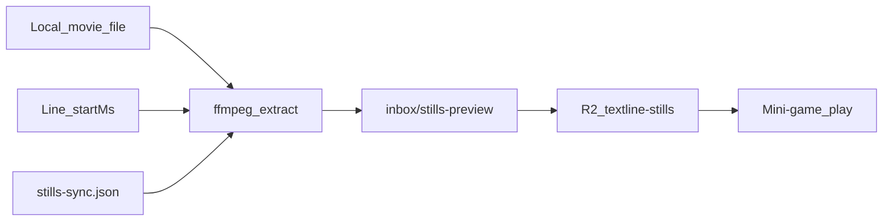

# Textline → Nextline

A quoting game built around movie and TV transcripts. You're shown a line — guess what comes next.

**Core loop:** Read a line from a script → pick (or type) the next line → advance or score out.

---

## Concepts

### Concept 1: Transcript run (primary)

Walk through a full transcript from start to finish. Your score is how far you get — unless you're in **Fun** mode, where misses don't end the run.

- Start at line 1.
- Each correct answer reveals the next line and presents the following one as the next question.
- **Fun mode:** infinite forgiveness — a wrong answer lets you try again on the same question.
- **Medium / Hard:** one wrong answer ends the run; final score = number of consecutive correct lines.

This is the default game mode and the focus of Phase 1.

### Concept 2: Quote challenges (later)

Find a memorable quote, share it with friends, and let them guess the next line.

- Search or browse transcripts for a good setup line.
- Send a link to a one-off challenge — or send a Curate line to a friend or a [named group](#friends--question-inbox).
- Friend plays the single question (or a short streak) without needing the full run context.

Useful for async play and social sharing; builds on the same transcript + question engine from Concept 1.

---

## Gameplay

### Difficulty (default: Fun)

| Mode | Input | Single-player (Phase 1) | Multiplayer wrong answer (Phase 2) |
|------|--------|-------------------------|-------------------------------------|
| **Fun** (default) | Multiple choice — 1 correct next line + distractors | **Infinite forgiveness** — wrong answer → try again; run ends when the transcript ends | Wrong answers **tracked** (right/wrong per player); **same player tries again**; no elimination |
| **Medium** | Free text — exact or fuzzy match against transcript | One wrong answer ends the run | A miss **eliminates that player**; remaining players continue |
| **Hard** | Free text with stricter matching / no hints | One wrong answer ends the run | One miss **ends the game for the whole team** |

### Scoring (Concept 1)

- **Fun mode:** score = lines completed when you reach the end of the transcript; wrong attempts tracked but don't end the run.
- **Medium / Hard:** score = highest line index reached before a miss (0 if you miss the first question).
- **Streak** = consecutive correct answers in the current run.
- Optional later: leaderboards per title, daily challenges. Personal bests and match history land in [Phase 2.5](#phase-25--reputation--profile-after-2a).

---

## Transcript library

The game does **not** fetch subtitles at play time. It runs on a **curated library of transcripts** that we build up over time. The catalog today includes **Tier-1 movies**, **Simpsons Seasons 4–5**, and a hidden sample. More titles come from a Letterboxd likes ∪ 4.5★ queue — see the [content workstream](docs/ROADMAP-content.md).

### Authoring: transcript_maker

**transcript_maker** is a sibling companion project for creating and cleaning transcripts (local path: `../transcript_maker`).

- Import SRT/VTT/SubViewer (`.sub`) or find a film via TMDB + OpenSubtitles (local proxy).
- Generate a readable transcript (merge continuations, strip tags, optional SDH).
- Export **timed JSON** (`workToTimedJson`) — title, cues, and `transcript.blocks` with text and timing.

That export is the handoff format into this game's content store.

### Content backend (lightweight)

A small **content layer** (not a full app backend) holds transcripts the game can serve:

```
transcript_maker → export JSON → content store → game API / static bundle
```

| Piece | Role |
|-------|------|
| **Authoring** | transcript_maker in the browser — one-off or batch prep |
| **Content store** | Versioned files or DB table: metadata + ordered lines (from `TranscriptBlock[]`) |
| **Game** | Read-only: list titles, load lines by index, generate MCQ distractors |

**MVP:** Check in a few episode JSON files (or seed a DB from them). No runtime subtitle search.

**Later:** Admin ingest script (drop JSON in a folder → validate → publish), and a growing catalog as new titles are transcribed ([content workstream](docs/ROADMAP-content.md)). Show/season/episode metadata and Movies \| TV library browse are already in use.

### Line model for the game

Each playable **line** maps from a transcript_maker `TranscriptBlock`:

- `index` — 0-based order in the episode (this is the score / progress unit)
- `text` — block text (speaker dashes stripped, same as Markdown export)
- `startMs` / `endMs` — optional; quote stills (Phase 2.6) seek to `startMs`

Distractors for multiple choice come from **other lines in the same transcript** (prefer nearby lines) so wrong answers feel plausible. A similarity gate skips look-alikes (≥60% token Dice/containment vs the correct next line or another choice) — see [MCQ similar-answer guard](#mcq-similar-answer-guard).

---

## Phase 1 — Single-player (MVP)

**Goal:** One player can search a title, play through a transcript, and get a score when they miss.

### Features

- [x] **Transcript library (seed content)**
  - Import 3–5 episodes from transcript_maker JSON exports
  - Store as versioned content (files in repo or DB seeded once)
  - Metadata: title, show/season/episode if applicable, line count

- [x] **Pick a title**
  - Browse or search the curated library (no live SRT fetch)

- [x] **Game session (single player)**
  - Show the current line
  - Present multiple choice for the **next** line (Fun mode)
  - Correct → advance to next line, repeat
  - Wrong (Fun) → try again on the same question
  - Wrong (Medium/Hard) → end run, display score

- [x] **Minimal UI**
  - Search / pick a title
  - Play screen (current line, choices, progress)
  - Game over screen (score, option to restart same title)

### Out of scope for Phase 1

- Accounts / logins
- Multiplayer
- Quote sharing (Concept 2)
- Medium/Hard free-text modes (Fun / MCQ only for Phase 1)
- Leaderboards
- Runtime subtitle search or OpenSubtitles integration

### Phase 1 success criteria

- At least a few episodes are playable from the curated library.
- User picks a title and plays through the transcript (Fun mode: until the end; Medium/Hard: until one miss).
- Score reflects how many lines they got right.
- New episodes can be added by exporting from transcript_maker and dropping into the content store.

---

## Phase 1.8 — Library browse UX

**Goal:** Once the catalog mixes movies and multi-season TV, a flat title list is too noisy. Browse by kind, then drill into shows.

### Features

- [x] **Episode meta on import** — parse `Show - 5x01 - Name` into `meta.show` / `season` / `episode`
- [x] **Grouped library** — Movies list + TV Shows → season → episode (`libraryGroups` + `LibraryScreen`)

Home rails (“your recent” + top played) live on the signed-in **Home** landing in [Phase 2.5](#phase-25--reputation--profile-after-2a); **Browse full library** uses this grouping.

---

## Phase 2 — Multiplayer

**Goal:** 2–4 players take turns guessing the next line in the same transcript run. Prefer **logged-in** players once Phase 2a ships (display name from account).

### Phase 2a — Auth + share mini-game *(before rooms)* ✅

Shipped on main (PR #5). PR #6 followed with safer per-title star push and MCQ prompt lead-in.

- [x] **Magic-link login** — email link via Resend; session on Worker + D1
- [x] **Login gate** — browse/play requires sign-in
- [x] **Editable display name** — `PATCH /api/auth/me` from the auth bar
- [x] **Claim anonymous stars** — map browser `playerId` → user on first sign-in
- [x] **Share mini-game link** — `#/play/:shareId`; recipient must sign in
- [x] **Attribution / scores** — `shared_runs` leaderboard per share

### Phase 2a.1 — Local auth polish

- [x] **Origin-aware magic links** — email link uses the request `Origin` when it is in `ALLOWED_ORIGINS` (so localhost gets a localhost link). **Redeploy the Worker** for this to apply against the production API.
- [x] **Vite-only continue** — “Continue without signing in (local only)” on the login screen in `npm run dev`

### Phase 2a.2 — Google Sign-In *(reduces magic-link friction)*

Keep the **login gate** (browse/play still require an account). Add one-click Google beside magic link (Yahoo/etc. still use email).

- [x] **GIS button + Worker ID-token verify** — Google Identity Services on the login screen; `POST /api/auth/google` verifies the JWT (aud/iss/email) and creates the same D1 session as magic link
- [x] **Config** — Worker `GOOGLE_CLIENT_ID`; `GET /api/auth/config` exposes it; optional `VITE_GOOGLE_CLIENT_ID` fallback. **You still need** a Google Cloud OAuth Web client + published consent screen for non-test users.
- [x] **Cost** — Google Sign-In is free; no per-login fee

### Features (rooms — later)

- [ ] **Room / session**
  - Host creates a game (pick title, player count 2–4)
  - Share join link or short room code
  - Players use account display name (or enter a display name if guest policy allows)

- [ ] **Turn rotation**
  - On each question, one player is "on the clock"
  - Correct → next player's turn, advance line
  - Wrong → handled by difficulty (see table above):
    - **Fun:** increment wrong count; **same player tries again** (infinite forgiveness)
    - **Medium:** that player is eliminated; others keep going
    - **Hard:** entire room ends immediately

- [ ] **Shared state**
  - All players see the same current line and whose turn it is
  - Real-time sync (WebSocket or similar)
  - MCQ options generated once per turn; everyone sees identical choices

- [ ] **End game**
  - **Fun:** standings by correct / incorrect counts (and lines advanced)
  - **Medium:** last player standing, or highest score among survivors
  - **Hard:** team score = lines completed before the single miss

- [ ] **Popular-line room** *(name open)* — a room length besides the full transcript
  - Walk the title’s crowd-popular starred lines, in transcript order
  - **All, or most** — long enough for a night with friends, not a 10-pack mini-game and not every cue
  - Same turn rotation and shared board as the full-transcript room
  - Name is unset; “popular-line room” is only a working label

### Open design questions (Phase 2)

- **Reconnect:** Session token from Phase 2a auth?
- **Popular-line room:** what to call it; whether the queue is every crowd-popular line or a long cap once star counts thin out

---

## Phase 2.5 — Reputation & profile *(after 2a)* ✅

**Goal:** Gamify without waiting on rooms or global leaderboards. Every completed run is recorded. Signed-in players get a tabbed profile (account, match history, game stats). **Home** is the landing (recent + top played); the full catalog is one click away under Browse. End-of-run thumbs collect a light quality signal for later popular-star ranking.

Auth already exists (Phase 2a). Solo `GameRun` used to be **client-only** — the only persisted scores were `shared_runs` on a share link. Crowd popular remains a raw `COUNT` of stars per line (thumbs are stored, not yet applied).

### Features

- [x] **Persist runs** — on complete (finished or miss), write a row to D1 for the signed-in user. Include full-episode and mini-game, plus shared mini-games (keep `shared_runs` for the share leaderboard; also log a personal `runs` row so history is one table).
- [x] **Profile** — auth bar name opens a profile with tabs: **Account** (display name), **Match history**, **Game stats** (games played, lines guessed, titles touched, personal most-played). Reputation is those totals — not ELO.
- [x] **Match history** — list on the profile: **game** (full vs mini, mode), **title** (movie or show + episode), **score** (`correct / questions`, plus wrongs/skips), and stored thumbs when present. Mini runs with a saved prompt list can **Share** an exact replay (`#/play/:shareId`); a short cohort line shows who played. Newest first. Personal; not a public leaderboard.
- [x] **Home + library** — signed-in landing is **Home**: **your recent**, **your top played**, then **top movies / shows · everyone** (global play counts). Crowd rails show even if you have no games yet. **Browse full library** opens Movies \| TV. Clicking a title shows who has played it most and who has the high game.
- [x] **Thumbs on complete** — optional thumbs up / down on the game-over screen (skip allowed). One rating per run, changeable until they leave. Stars stay “this line is a TL”; thumbs are “this session was a good game.”
- [ ] **Light weight on popular *(later slice)*** — do **not** change `/api/stars/popular` in the same ship as collecting votes. When enough ratings exist, apply a small title-level nudge (clamp about ±10%) so well-liked titles’ crowd stars surface a bit sooner. Never hide or unstar a line from a thumbs-down.

### Data (D1)

New `runs` table, keyed by run id (many games per user + title):

| Column | Notes |
|--------|--------|
| `id` | UUID |
| `user_id` | Signed-in player |
| `title_id` | Catalog id |
| `length` | `full` \| `mini` |
| `mode` | `fun` \| `medium` \| `hard` |
| `correct_count`, `wrong_count`, `skip_count` | Same as today’s complete screen |
| `question_total` | Denormalize so history does not need the catalog |
| `end_reason` | `finished` \| `miss` |
| `share_id` | Nullable; set when the run was (or became) a shared mini-game |
| `question_queue` | JSON array of prompt line indices for mini-games; required to share an exact replay |
| `completed_at` | ISO timestamp |

New `run_ratings` (or `thumb` on `runs`): `up` \| `down`, `rated_at`. Unique on `run_id`.

Indexes: `(user_id, completed_at DESC)` for history; `(title_id)` for top-played; optional `(user_id, title_id)` for personal bests.

**Reputation (v1):** derived, not a stored ELO. Example: rank from total `correct_count` (and maybe games finished). Enough to feel like progress; competitive ladders stay Phase 4.

**Top played:** `COUNT(*)` of runs per `title_id`, then group TV with existing show metadata (`libraryGroups`). Movies stay per title.

### Later popular formula *(not v1)*

Keep star **count** as the primary sort. Then a small multiplier from net thumbs on that title:

```
popular_score ≈ star_count × (1 + ε × title_sentiment)
```

`title_sentiment` is mean of run thumbs on that title (up = +1, down = −1), `ε ≈ 0.1`, clamp the factor to roughly `0.9–1.1`. Optional extra: slightly down-weight a player’s stars on a title they thumbs-downed. Thumbs never dominate a 3-star vs 1-star gap.

### Out of scope for 2.5

- Public / friends leaderboards (Phase 4)
- Rooms / realtime (Phase 2)
- Changing what a **star** means
- Requiring a thumb to leave the complete screen
- Anonymous run log (play already requires sign-in)

### Done when

- Finishing (or missing out of) a solo or shared game writes a `runs` row.
- Profile shows stats + a match-history list (game, title, score, thumbs when present).
- Home lists your recent + your top played, then everyone’s top movies/shows (visible with zero personal games). Opening a title shows per-title leaders (most played / high game).
- Complete screen has optional thumbs; ratings persist; popular ranking is **unchanged** until the later weight slice.
- Mini-game history rows with a saved prompt list can share an exact replay; Setup share still uses live stars.

### Suggested build order

1. `runs` migration + `POST /api/runs` from `CompleteScreen` (auth session).
2. `GET /api/runs/mine` → profile match history + derived stats / rank.
3. `GET /api/stats/played` → library rails (global counts, grouped with `libraryGroups`).
4. Optional thumbs on complete → `run_ratings`.
5. After real vote volume: weighted popular as a follow-up PR with a feature flag.

### Exact replay from match history

Setup **Share mini-game** still means “play my **current** stars” (queue is rebuilt + shuffled each time). Sharing a **finished mini-game** from history freezes that run’s prompt line indices in order. Friends play the same 10 setups; MCQ distractors may still shuffle. Full-episode rows have no Share. Runs completed before queues were persisted cannot be shared exactly.

---

## Phase 2.6 — Quote stills, R2, catalog ops *(after 2.5)* ✅

**Goal:** Mini-game prompts show a still from the moment that line is spoken — not only the one-sheet. Extract locally, eyeball a handful, then serve production frames from a private R2 bucket. The owner gets a catalog dashboard (stars, plays, still coverage, disk). Seed-push cannot overwrite stars you curated in the app.

Does **not** wait on rooms. Auth (2a) is the only gate for Catalog.

### Features

- [x] **Starred stills** — ffmpeg at line `startMs` (`× timeScale + offsetMs`). PAL 25 fps vs theatrical → `timeScale: 0.96`. Per-title sync in [`content/stills-sync.json`](content/stills-sync.json).
- [x] **Remux** — AVI/Xvid needs generated PTS (`content:stills:remux` → gitignored `inbox/media/{titleId}.mkv`). Skip remux when the encode already matches theatrical (Wolf BluRay).
- [x] **Mini-game art** — still `/stills/{titleId}/{lineIndex}.jpg` → poster → hide. Full-episode play stays text-only.
- [x] **Dev `/stills`** — Vite serves gitignored `inbox/stills-preview/`.
- [x] **Production R2** — private bucket `textline-stills` + Pages Function [`functions/stills/`](functions/stills/). Push with `content:stills:push`.
- [x] **Owner Catalog** — `#/ops`, visible only to `dascolin@gmail.com` (`local@dev` in Vite). Sortable columns: curated, stars, plays, still %, on-disk.
- [x] **Disk match** — `content:uploads` vs `G:\videos\movies` → [`content/uploads.md`](content/uploads.md) + `stills-coverage.json`.
- [x] **Protect curated stars** — [`content/stars-protected.json`](content/stars-protected.json). Seed push skips those ids even with `--force`, and skips **any** title that already has live stars unless `--force`.
- [x] **Agent skill** — [`.cursor/skills/stills-extract/SKILL.md`](.cursor/skills/stills-extract/SKILL.md). Stop after a starred handful until the frames match.
- [x] **Catalog ingest (this branch)** — Back to the Future 1–3, Gone in 60 Seconds, Goodfellas, O Brother, 40 Year Old Virgin, Lebowski. Dune skipped (incomplete SRT).



### Status

Live D1 vs `stars-seed.json` for `dascolin@gmail.com`. **Protected** = live count ≠ seed (curated in-app). Every other title that already has stars is still skip-on-push.

| Title | Live | Seed | Stills | R2 | Protected |
|-------|------|------|--------|----|-----------|
| Ocean's Thirteen (2007) | 125 | 79 | 125, PAL `0.96` | yes | yes |
| The Wolf of Wall Street (2013) | 67 | 2 | 67, scale 1 | yes | yes |
| The Empire Strikes Back (1980) | 81 | 21 | 81, PAL `0.96` | yes | yes |
| Payback (1999) | 78 | 49 | posters only | — | yes |
| Inglourious Basterds (2009) | 115 | 112 | 115, scale 1 | yes | yes |
| Batman Begins (2005) | 79 | 0 | 79, scale 1 | yes | yes |
| Django Unchained (2012) | 44 | 14 | 44, scale 1 | yes | yes |
| The Gentlemen (2019) | 122 | 63 | 122, mid-cue | yes | yes |

32 titles have live stars; a default `stars-push --remote` would only insert **Goodfellas (5)** and **Lebowski (1)** (new catalog, no live rows). Do not `--force` protected titles.

**Posters** (drop-in `public/posters/{titleId}.jpg`; 404 → hide): Empire, Inglourious, Payback, Ocean's 13.

### Out of scope for 2.6

- Every-cue extract, git-lfs, shipping video, random poster rotation
- Player reports (wrong still / request still / split line) — see [Line / still feedback](#line--still-feedback)
- Weighted popular (2.5 leftover)
- Rooms / realtime (Phase 2)

### Done when

- Confirmed titles’ starred stills are on R2; play uses `/stills` after Pages deploy (404 → poster).
- Catalog ops is owner-only and sortable.
- `content:stars-push` cannot touch protected titles or any title that already has live stars (unless `--force`, which still honors the protected file).

### Suggested build order

1. Remux + extract CLI + `stills-sync.json`.
2. Mini-game `PosterArt` still → poster.
3. Vite `/stills` from `inbox/stills-preview`.
4. R2 bucket + Pages Function + `content:stills:push`.
5. Owner Catalog `#/ops` + disk uploads table.
6. Expand `stars-protected.json` whenever live stars diverge from seed.

Commands: [Extract stills](#extract-stills-local) and [Quote stills (R2)](#quote-stills-r2). Deploy notes: [docs/DEPLOY.md](docs/DEPLOY.md#quote-stills-r2).

---

## Spike: curated / saved mini-game packs *(not building)*

Named playlists of quotes (pick 10 lines, save, replay, share) is a different product from **stars** (personal TL seed) and from **frozen run-replays** (the accident of one play). A history Share is the cheap prototype of “a really good 10.” Use that in the wild before building an editor.

**Later: Curate mini-game builder** *(backlog — not the star Curate screen)*

Build a mini-game from the title’s starred pool with filters/sorts before locking a queue:

- **Starred by** — dropdown over who has stars on this title; selecting people takes the **union** of their starred lines (not intersection). Include “everyone / crowd” as an option when useful.
- **Sort by** — most starred · most played · chronological forward · chronological reverse (then take the top *N* / shuffle within the sorted set as needed).

Open questions (spike only — no pack UI yet):

- Title-scoped vs mixed-title packs
- Order: curated sequence vs shuffle-on-play
- Edit after someone has already played the pack
- How this relates to stars / thumbs / crowd popular
- Curate UI: pick from transcript vs “save this run as a pack”
- Whether “most played” is per-line (prompt appeared in runs) or title-level until line stats exist

---

## Phase 3+ — Social & polish *(backlog)*

- [x] **Loved / double-star quotes** — ♥ up to 5 golden lines per title; mini-games take loved first. See [Later ideas](#loved--double-star-quotes-next).
- [x] **Star-streak bias** — if sequential starred lines exist, mini-games include at least one streak and play those lines in order. See [Later ideas](#star-streaks-in-mini-games).
- [ ] **Popular-line room** *(name open)* — turn-based room walks the crowd-popular starred lines (all or most). See [rooms](#features-rooms--later).
- [ ] **Quote challenges (Concept 2)** — share a single line + guess link
- [x] **Friends graph (invite links)** — Profile → Friends copies `#/friend/{token}`; they sign in and accept. No directory. See [Later ideas](#later-ideas-parked).
- [x] **Question inbox** — Curate send icon → friend’s inbox (or copy a 1-line `#/play` link). See [Later ideas](#later-ideas-parked).
- [x] **Chats (DMs + shared group threads on Home)** — `#/chats`, `#/chat/{userId}`, `#/chat/group/{groupId}`; Home rail; bell. See [Chats](#chats-dms--shared-group-threads).
- [x] **Named friend groups** — Profile → Friends send-lists; one Send fans out the same 1-line share. Attempt-chat stays later.
- [x] **Send cooldown: per recipient, not global** — Reuse one frozen share across friends; 10s debounce only for same line → same person. See [Recent feedback](#recent-feedback-parked).
- [ ] **Difficulty modes** — Medium/Hard free text
- [ ] **Leaderboards** — per title, global, friends (builds on the Phase 2.5 run log)
- [ ] **Curate mini-game builder** — filter starred-by (union) + sort (most starred / most played / chrono ↔); see [Spike: curated packs](#spike-curated--saved-mini-game-packs-not-building)
- [x] **Teach mode** — Fun skip greens the correct choice and holds 2s; Teach skip opens this-line / next-line **Got it** card. See [Later ideas](#later-ideas-parked).
- [x] **Scene / poster visuals (2.6)** — starred stills + posters + R2; leftover every-cue / video. See [Phase 2.6](#phase-26--quote-stills-r2-catalog-ops-after-25).
- [ ] **Curator reputation** — count (and weight) stars people lay down. See [Later ideas](#later-ideas-parked).
- [ ] **Watch-list connect** — Letterboxd / Trakt → “you might like” + title requests. See [Later ideas](#later-ideas-parked).
- [ ] **UGC quotes (IG / YT)** — paste a link, infer or type **one** line into a personal library. See [Quotes from anywhere](#quotes-from-anywhere-lay-person).
- [ ] **YouTube videos as titles** — paste a video URL → pull timed transcript → star / parallel packs → optional scene frames. See [YouTube videos as titles](#youtube-videos-as-titles).
- [ ] **Chats → quote replies** — text replies under a quote card (thread-lite). See [Chats → quote replies](#chats--quote-replies).
- [ ] **Chats → cross-title mini-games** — multi-select lines in a thread (any titles) → save as a custom mini-game. See [Chats → cross-title mini-games](#chats--cross-title-mini-games).
- [ ] **Songs** — lyrics as transcripts; song library + mini-games. See [Later ideas](#later-ideas-parked).
- [x] **MCQ similar-answer guard** — drop distractors ≥60% similar to the correct next line (or each other). See [Later ideas](#later-ideas-parked).
- [ ] **Split multi-sentence lines** — curator (or import) splits one cue into sentence beats without reminting star indices. See [Later ideas](#later-ideas-parked).
- [ ] **Line / still feedback** — players report wrong scene image, request a scene image, or ask to split a line. See [Later ideas](#line--still-feedback).
- [ ] **Security check / audit ladder** — staged levels (not one giant audit). See [Spike: security ladder](#spike-security-ladder-not-a-full-audit-yet).
- [x] **Quote parallels / analogy packs (Light)** — Curate 3–500 lines → pack; catalog connections + upvotes; `#/parallel/{id}`. Medium (chat/URLs/Home rail) deferred. See [Later ideas](#quote-parallels--analogy-packs).
- [x] **Share quote as image** — caption-below + on-image; Original aspect; Clean/Ink/Lime/None; remembered prefs. See [Share quote as image](#share-quote-as-image).
- [ ] **Daily quote email** — ~3 quote cards in email → open TLNL (Readwise-style). Builds on share cards. See [Daily quote email](#daily-quote-email).
- [x] **Global search** — `#/search`; client-side over eager catalog; Popular / Starred by me; title + line hits. See [Global search](#global-search).
- [x] **Onboarding + play UX clarity** — first-share coach tip; distinct Skip; A–D + radio chrome on MCQ. See [Later ideas](#onboarding--play-ux-clarity).
- [ ] **More sources** — beyond SRT (official scripts, fan transcripts) with licensing notes
- [x] **Mobile home screen (PWA-lite)** — Manifest + icons + Home install helper (Android / iOS); no SW. See [Later ideas](#mobile-home-screen-pwa-lite-before-native-apps).
- [ ] **Daily challenge** — same title + start line for everyone
- [ ] **Obsidian → TL pipeline** — see [Concept 3](#concept-3-obsidian--tls-textlines-backlog) below
- [ ] **Online quote sources spike** — see [Spike: online quotes](#spike-online-quotes-eg-imdb-research) below

### Spike: security ladder *(not a full audit yet)*

Users care; a single “do security” project will bog us down. Prefer a **ladder**: ship the cheapest high-value rung first, stop when risk matches how public/sensitive we are. Auth today is magic link + Google → D1 sessions; stars/runs/shares are account-scoped.

| Level | What | Type | Effort | Ongoing maintenance | When |
|-------|------|------|--------|---------------------|------|
| **L0 — Hygiene** | Secrets only in Wrangler/CI; no tokens in git/logs; `ALLOWED_ORIGINS` + CORS; OAuth JS origins match prod; confirm `/api/auth/config` doesn’t leak secrets | Config / ops | Hours | Low — revisit when adding origins or secrets | **Do soon** (checklist after each auth change) |
| **L1 — Auth & session pass** | Session TTL / logout; Bearer required on runs/shares/me; Google JWT aud/iss/email_verified; magic-link rate limit; claim-anonymous can’t steal another user’s stars | App security review | ½–1 day | Low — re-check when touching `api/src/auth.ts` / shares | After 2a.2 settles; before inviting many friends |
| **L2 — Abuse & data bounds** | Input validation already on stars/runs; add soft rate limits (stars, shares, magic links, friend rotate); don’t return other users’ emails (friend list is `userId` + `displayName` only); D1 migration checklist so prod never drifts (e.g. missing `question_queue`) | Product + ops | 1–2 days | Medium — tune limits if spam appears | When share links go beyond a small circle |
| **L3 — Dependency / supply chain** | `npm audit` (root + `api/`); pin/update `jose` / wrangler; Dependabot or periodic manual bump | Supply chain | Hours, then recurring | Medium — monthly or on alert | Cheap; can run in parallel with L1 |
| **L4 — Cursor Security Review** | Run the in-repo security-review agent on branch/PR diffs for auth/API changes | Process | Per PR (~minutes–hour) | Low if only on sensitive PRs | Habit on auth/API PRs — not every content PR |
| **L5 — External / formal audit** | Paid pen-test or third-party review; threat model doc; bug bounty | Formal assurance | Weeks + $ | High — re-audit after big changes | Only if we hold sensitive PII at scale, go commercial, or enterprise users demand it |

**Suggested sequence:** L0 → L1 → L3 (parallel) → L4 as habit → L2 when sharing grows → **skip L5** until the product outgrows a friends-and-family footprint.

#### L0 hygiene checklist *(pass Sep 2026)*

- [x] Secrets (`RESEND_API_KEY`, `AUTH_SECRET`, `GOOGLE_CLIENT_ID`) via `wrangler secret put` — not committed; `api/wrangler.toml` only has public `ALLOWED_ORIGINS` / `APP_ORIGIN` / `RESEND_FROM`.
- [x] `GET /api/auth/config` returns `{ googleClientId }` only (OAuth client id is public by design; no API keys).
- [x] CORS via `ALLOWED_ORIGINS` includes localhost + Pages + `textlinenextline.com`.
- [x] No `.env` / credential JSON in git for the Worker (Pages `VITE_*` are build-time public).

Re-run this list after any auth or origin change. L1+ still open.

**Out of scope until needed:** full SOC2, CSP perfectionism, WAF product, encrypting all D1 at app layer (Cloudflare already encrypts at rest), storing passwords (we don’t).

**Open questions:** publish a short public “how we handle accounts” note?; whether share meta should hide owner email and show display name only.

---

### Concept 3: Obsidian → TLs (Textlines) *(backlog)*

**Idea:** Treat Obsidian as a personal quote mine for **TLs** (memorable lines / setups from TLNL). Import and rank them into the game, then layer social context (who watched with whom, who likes which TL).

| Source in Obsidian | Signal | Suggested star weight |
|--------------------|--------|------------------------|
| Manually copied quotes | Strong curation | Highest (seed personal + crowd boost) |
| Highlighted spans in a transcript note | Intentional “this mattered” | High |
| Fuzzy match of quote text → `content/` line index | Linking vault → game | Required for playable TLs |
| Frontmatter / tags / “watched with …” | Co-watchers | Social graph input |

**Build slices (doable in order):**

1. **Vault scrape (local CLI)** — ✅ Readwise Obsidian folder (`--vault` on `content:queue`): extract `## Highlights`, match notes to the Letterboxd queue by title+year, write `content/readwise-highlights.json`.
2. **Match to transcript** — Partial: fuzzy map highlight text → `(titleId, lineIndex)` into `content/stars-seed.json` when that title is already in `content/titles/`. Manual review still needed for misses.
3. **Weighted seed into stars** — Not yet: applying `stars-seed.json` to D1 / the Curate UI.
4. **Watch parties (metadata)** — Store “session: title + people present” from Obsidian; associate TLs with that group.
5. **Login + group popularity** — Real accounts (or stable invite tokens); stars scoped to a pair / triple / group. “Most popular TLs among us” = intersection or ranked aggregation over that set — same D1 pattern as today’s crowd `popular`, with a `group_id` filter.

**Wildness rating:** ~6/10 on product ambition, ~4/10 on technical risk. Scrape + fuzzy match is ordinary NLP plumbing; co-watcher inference is messy data (inconsistent notes), not hard code. Login + group popularity is the real phase gate — but we’ve already proven anonymous `playerId` + D1 aggregation; accounts just make identity durable across devices.

**Open questions:** Obsidian highlight format (core vs plugins); how titles are named in the vault vs `content/catalog.json`; privacy (vault stays local — only matched TLs leave the machine). Line **stars** stay the playable pool; **love / double-star** (queue bias for golden lines) is [next](#loved--double-star-quotes-next). Session **thumbs** (Phase 2.5) stay a lighter ranking signal.

### Spike: online quotes (e.g. IMDb) *(research)*

**Idea:** Seed TLs from public quote pages (IMDb Quotes, Wikiquote, fan wikis, etc.) for titles we already have in `content/`, then fuzzy-match into `(titleId, lineIndex)` — same match step as Obsidian imports.

**Why it might be hard:**

| Risk | Notes |
|------|--------|
| **ToS / scraping** | IMDb and similar sites generally disallow automated scraping; no friendly public quotes API for bulk use |
| **Fragile HTML** | Selectors break; rate limits / bot detection |
| **Quote ≠ transcript** | Online quotes are often cleaned, paraphrased, or misattributed — match rate to SRT lines may be low |
| **Episode grain** | Movie quotes map cleaner than TV (which episode?) |
| **Licensing** | Re-shipping scraped quote corpora in the product may be riskier than personal Obsidian notes |

**Spike goal (time-box):** For 1–2 titles already in the library, manually or semi-automatically pull a small quote list → match against our lines → report hit rate and effort. Decide go / no-go before building a pipeline. Prefer sources with clearer reuse terms if any exist; treat IMDb as “interesting target,” not a committed dependency.

**Fits with:** Obsidian → TL match pipeline (reuse fuzzy match + Curate review). Online sources are an alternate *input*, not a separate game feature.

---

## Later ideas *(parked)*

Not sequenced. Steer as we go. Teach mode, the **MCQ similar-answer guard**, **quote stills (2.6)**, the **friends graph**, **question inbox**, **named friend groups**, **Loved / double-star**, **star-streak bias**, **play UX clarity**, **Chats** (DMs + shared groups on Home), **global search**, and **PWA-lite** (Add to Home Screen) are in. Line-splitting is the leftover “what counts as a line” work. **Line / still feedback** (wrong image, request image, split line) stays parked. Attempt-chat on a 1-line share is still parked. **Quote parallels** Light is in (Medium deferred). **Share quote as image** is in (aspect + palettes + prefs). **Daily quote email**, **Chats quote replies**, and a **popular-line room** (name open) stay parked. Native iOS/Android store apps remain a later goal.

### Loved / double-star quotes ✅

Today a mini-game fills 10 from your personal stars (shuffled), then crowd popular, then random. If a title has ~80 stars, the handful of **golden** lines often miss the queue.

**Love** (♥) a small set so they generally appear in most mini-games for that title. Star stays “this is in the pool”; love is “this is a banger — bias the queue.” Not session thumbs (2.5) and not curator-score (other people’s stars).

**In:** `loved` flag on `(title_id, line_index, player_id)`; Cap **5** per title. `buildMiniGameQueue` takes loved first, then other personal stars. Curate + Play show ♥ when starred. `PUT /api/stars/love`. Library cover stills preferring a loved frame stays later.

### Star streaks in mini-games ✅

A **star streak** is two or more starred lines in a row (adjacent quiz prompts in the transcript). Among a large star pool, a streak often missed the cut, so the chain never played.

**In:** `buildMiniGameQueue` finds personal-star streaks (loved ∪ starred), prefers the longest, and seeds the queue with that run (trimmed to mini size if needed). Chronological sort keeps the streak sequential in play. Loved lines still fill remaining slots next.

### Popular-line room *(name open)*

A room mode for 2–4 players, turn-based, on the same board. Instead of the full transcript or a 10-line mini-game, the room walks the title’s **crowd-popular starred lines** — all of them, or most, if the popular set is long. Lines stay in transcript order. Same turn rotation as the [full-transcript room](#features-rooms--later).

The name is unset. “Popular-line room” is a working label only.

### Friends + question inbox

Today’s 10-pack share is an **anonymous mini-game URL**. This is **directed**, **one question**, from **Curate** (star filter). Concept 2 stays the play-a-single-line engine; this is how it arrives.

**Friends (gate) ✅.** Mutual friendship via an unguessable **friend link**. Profile → Friends copies `#/friend/{token}`; they sign in and tap Accept. One live link per account; **Rotate** invalidates the old URL (tokens stored as `token_hash` only). List is `{ userId, displayName }` — never email. No `GET /api/users`, no search-by-name, no “who’s online.” Cannot friend yourself. **Remove** drops the pair; **Block** drops it and rejects future accepts from that person even with a new link. Cap ~50. Must be signed in (local Vite “Continue without signing in” has no graph).

**Send ✅.** Same overlay from **Curate** (top-right icon on each quiz line) and **Play** (next to Star on the current prompt). **Copy link** is a frozen 1-prompt `#/play/{shareId}`; **Send** goes to a friend or a **named group**. Recipient must already be a friend. Block still wins. Must be signed in. Notes stay later. Same line to several friends reuses one share; 10s debounce only applies to **same line → same person**.

**Inbox ✅.** Home **From friends** and Profile → **Inbox** show a list of quiz cards (the line + choices). Guess right and the card compresses to textline + nextline. Group send is still one inbox row per person (same `shareId`).

**Groups ✅.** Owner-only lists on Profile → Friends (e.g. “Movie night”). Members must already be **your** friends. Cap ~10 groups / ~20 members. Unfriend or block drops that person from **your** groups. No shared clubs, no directory, no emails. Local Vite shortcut has no groups.

**Not this:** rooms (Phase 2), 10-pack mini-game shares (2a), loved-cover stills, exposing emails on friend/share meta, Discord-style servers.

**Attempt chat** *(later).* Person icons in a chat-like thread for who got that 1-line share **first try / second try / third try**. Not rooms. Belongs **inside** Chats threads next to that share.

### Chats (DMs + shared group threads) ✅

**Why:** Flat Inbox felt like a mailbox. Chats are conversations — DMs with friends and shared group threads — on Home.

**Shipped:**

1. **DM** (`#/chat/{userId}`) — chronological in + out for direct sends only (`group_id` null).
2. **Group** (`#/chat/group/{groupId}`) — every member sees the same collapsed transcript; any member can send; fan-out stores `group_id`. Owner still manages membership in Profile → Friends.
3. **Home + bell** — Chats rail; `#/chats` list; Profile tab **Chats** (old `#/profile/inbox` redirects). Dual unread: quote chips (`line_inbox.read_at`) and text chips (`chat_thread_reads` watermark).
4. **Separation** — group sends appear only in the group thread, not also in each pair’s DM.
5. **Text messages** — composer in-thread; `chat_messages` one row per DM/group message; quotes and text share one timeline (`kind: quote | text`).
6. **Thread scroll UX** — message list scrolls inside the panel; composer stays put; open/send land on latest; **↓ Latest** when scrolled up.
7. **Richer quote cards** — outgoing + solved incoming show lead-in; outgoing always shows the next line (sender already knows it); **Correct** appears in the header after the peer solves.
8. **Quotes-only filter** — All / Quotes toggle in the thread header (client-side; sending text returns you to All).
9. **Emoji reactions** — 👍❤️😂😮🔥 on text and quote cards (`chat_reactions`; quote target = `share_id`).
10. **Answered receipt** — peer `line_inbox.solved_at`; sender sees **Correct** + next line on their outgoing card.
11. **Near-real-time refresh** — open thread polls ~4s; chat list ~8s; unread badges ~12s (pause when tab hidden). True push/WebSockets later if needed.

**Still later:** [replies under quote cards](#chats--quote-replies); attempt-score icons in-thread; packs as chat messages; leave/invite links; [multi-select in a thread → cross-title mini-game](#chats--cross-title-mini-games).

### Chats → quote replies

**Why:** A quote card is the unit of play in a thread. People often want to talk *about that line* without the reply floating as a free-floating timeline message.

**Shape *(parked)*:**

1. **Reply** on a quote card (incoming or outgoing) — short text that lives **under that card**, not as a peer of every other message.
2. Nested under the quote in the All view (and still visible under Quotes if we keep replies tied to the card).
3. Optional later: reply-to-text bubbles the same way; deep threads / collapse — start flat (one level under the quote).

**Not this:** Discord-style channel threads, or moving the whole chat into per-quote rooms. Same DM/group thread; replies are scoped to a `share_id` (or message id).

### Chats → cross-title mini-games

**Why:** A DM or group thread is already a curated mix of lines across movies/shows. Turning that into a playable mini-game (without re-hunting Curate per title) is a natural “our conversation → our game” loop.

**Shape *(parked)*:**

1. In a thread, **multi-select** message cards (incoming and/or outgoing).
2. **Save as mini-game** — frozen share queue spanning multiple `titleId`s (extend or wrap today’s frozen mini share).
3. Play / send like any other mini-game share.

**Gates:** queue format today is per-title; cross-title needs a share payload that lists `{ titleId, lineIndex }[]` (or multiple frozen shares). Cap length like mini (e.g. 10). Not the same as parallel packs (analogy), though UX can rhyme with Curate multi-select.

### Scene visuals *(leftover from 2.6)*

Starred stills, posters, R2, and the mini-game still→poster fallback shipped in [Phase 2.6](#phase-26--quote-stills-r2-catalog-ops-after-25). Library/Home title cards show a small **cover still** (lowest line index in [`content/stills-coverage.json`](content/stills-coverage.json) `covers`; no poster fallback on the card). Still parked:

- Every-cue extract (too heavy; starred landmarks first)
- git-lfs / checking JPEGs into the repo
- Shipping video, not stills
- Random poster rotation
- Player **wrong still** / **request still** reports (see [Line / still feedback](#line--still-feedback))

**Legal:** stills from your own files for a personal/curated app; don’t scrape streaming services.

### Curator incentives

How do we reward people who curate transcripts (stars), not only people who play? More granular: **track how many stars a person lays down**, then weight those stars by whether others also starred the same line and/or liked the game that used it (thumbs = less weight than a co-star). Complements Phase 2.5’s unused [popular-star formula](#later-popular-formula-not-v1) (title-level thumbs) with a **person-level curator score** and a **line-level quality weight**. Do not pay out on raw star count alone (easy to farm).

### Teach mode ✅

**Fun (default):** skip lights the correct MCQ choice the same way a hit does, then holds **2s** before advancing. Correct answers use the same hold.

**Teach:** same MCQ / try-again / skip as Fun. Skip opens a dialog of **this line → next line**; **Got it** dismisses it, then the run advances. Shared mini-games stay Fun.

### Watch-list connections

Connect **Letterboxd** (and maybe **Trakt**) to surface titles they might like — and let them **request** ones we don’t have yet. We already ingest a Letterboxd ZIP for the content queue; this is the player-facing version (OAuth / export, recommendations, request list). Trakt is optional if Letterboxd covers movies well; TV watch history may be the Trakt case.

### Quotes from anywhere (lay person)

Expand past our curated SRT catalog: **single** quotes from **IG, YT, anywhere**. Share a link → scroll to the quote time → infer the line if we can, or type/edit it → add it to **your** library. Curate a mini-game for friends, or send a **single** (Concept 2). Licensing, ToS, and “is this even our transcript?” are the product gates; the game loop (line → next line) stays the same.

Related but bigger: ingest a **whole YouTube video** as a playable title — see [YouTube videos as titles](#youtube-videos-as-titles).

### YouTube videos as titles

**Why:** A lot of quotable material lives on YouTube (interviews, monologues, essays, clips) — not only movies/TV with SRT drops. Same game once we have timed lines.

**Shape *(parked)*:**

1. **Paste a URL** — owner or curator submits a YouTube link.
2. **Extract transcript** — timed cues somehow (official captions / auto-captions / third-party; ToS and reliability TBD). Normalize into the same `Title` + `Line` shape as SRT imports (via transcript_maker or a sibling path).
3. **Play the catalog loop** — star lines, mini-games, **parallel packs**, Chats send — no special mode required once the title exists.
4. **Scene frames** — later, same stills idea as 2.6: grab frames at `startMs` (harder without a local file; may need screenshot API, user upload, or skip until we have media).

**Not this (v1 of this idea):** downloading full video into the app; competing with YouTube playback; free-text comments on the video.

**Gates:** YouTube ToS / caption licensing, auto-caption quality, dedupe (same video twice), and whether titles are personal-only vs shared catalog.

**Effort:** medium–large (ingest pipeline + legal spike before UI). Frames are a second phase after transcripts play.

### Songs

Song SRT files mostly don’t exist. Parse lyrics as a straight transcript; **infer timestamps** between lines, analyze the audio for timing, or just keep extra previous lines as context (like today’s lead-in). A **song library with curation** is a new catalog kind (not Movies \| TV) and a wider market.

### MCQ similar-answer guard ✅

Nearby distractors are plausible, but they can also be cruel: the next cue often repeats the last beat. Wolf of Wall Street ~546–547 is the example — *Let 'em watch.* vs *Let 'em watch. Know what I mean?* — same joke, two choices.

**In.** `pickDistractors` in [`src/lib/game/mcq.ts`](src/lib/game/mcq.ts) ranks by distance, then skips look-alikes:

1. Normalize (lowercase, strip punctuation / curly quotes).
2. Score vs the **correct** next line and vs **already-picked** distractors. **≥ 60% similar → reject** (`SIMILARITY_THRESHOLD` in [`src/lib/game/lineSimilarity.ts`](src/lib/game/lineSimilarity.ts)). Token Dice plus containment catches the *Let 'em watch* pair; raw Levenshtein alone can miss short repeats inside a longer line.
3. If the near pool is too thin, walk farther down the ranked list instead of re-admitting clones. If a short transcript still cannot fill 3 distractors, allow fewer choices rather than similar ones. If none remain, the question is skipped.

No content re-export. Shared mini-games freeze prompt indices, not distractors, so the guard applies on every play. Retune the 60% constant once we have a handful of real false positives (e.g. two “Yeah.” / “Okay.” lines that are actually different beats).

### Split multi-sentence lines

Some of the funny thing is **one sentence inside a cue**, not the whole subtitle block. One person says two beats in a single SRT line; the game today can only star / quiz the whole block.

**Doable, but don’t remint `line.index`.** Stars, shares, stills, and scores all key on index. Auto-splitting every transcript would orphan existing stars.

Later shape:

1. **Curate-time split** (preferred): on a line, “split into sentences.” Store an overlay (`parentIndex` + `part`) so the original cue stays the identity; new playable beats hang off it. Import-time auto-split only for titles that have no stars yet.
2. Sentence breaks on `.?!` after dialogue cleanup — same speaker, same cue. Don’t split on abbreviations / ellipses without a manual confirm.
3. Timestamps: keep the parent `startMs`–`endMs` unless we later proportion the span; stills stay on the parent cue.

The similar-answer guard and this split complement each other: even after a split, consecutive beats can still echo, so keep the 60% filter.

Players can **request** a split before the overlay exists — see [Line / still feedback](#line--still-feedback). Reports queue curator work; they do not split the live cue.

### Line / still feedback

Players (not only the owner) should be able to flag a textline: **wrong scene image**, **request a scene image**, **split this line**.

**Why:** Stills land at `startMs` and sometimes miss the beat; many starred lines have no frame yet (poster fallback); multi-sentence cues hide the punch. Today that only surfaces out of band.

**Shape *(parked)*:**

1. On Play / Curate, a light **feedback** control on the current line — not a full report form.
2. Three typed reports:
   - **Wrong still** — the frame doesn’t match this line (optional note: too early / too late / wrong scene).
   - **Request still** — no frame (or poster fallback); ask for one.
   - **Split line** — this cue is two beats; request a curator split (see [Split multi-sentence lines](#split-multi-sentence-lines)). Does not split live; queues overlay work.
3. Persist `(title_id, line_index, kind, user_id)` so Catalog / ops can sort by volume. Signed-in only. One vote per kind per line per user is enough for v1.
4. Owner Catalog shows a queue: wrong stills, missing stills, split requests — then the existing extract / split tools.

**Not this (v1):** players uploading replacement JPEGs; auto-reextract from a report; live split on play; public “this still is bad” chrome on the prompt.

**Gates:** Auth already exists. Reports must not change live stills or remint `line.index`. Split requests feed the overlay; still reports feed the [2.6 extract loop](#phase-26--quote-stills-r2-catalog-ops-after-25).

### Quote parallels / analogy packs

Some lines aren’t just next-line quiz material — they’re **templates people reuse**. Wolf of Wall Street’s “not fucking real” beat (and its cousins) gets adapted to whatever situation you’re in. That’s a different product from a one-off mini-game: a **special game** you return to, built around **parallels** — the same energy / structure / punchline in another film, TV scene, news moment, meme, or real-life context.

**Core object:** a **pack** = an ordered **section of lines** (a short list / beat, not only a single cue) from a title, plus play + connections + votes.

#### Light ✅ *(shipped)*

- Curate: select **3–500** lines → **Save as parallel pack** (creates a frozen `mini_share` + `analogy_packs` row).
- Pack page `#/parallel/{packId}`: show lines, **Play**, copy link, **Add a parallel** (short context + rewritten concatenated scene, optional send to a friend or group). Catalog movie defaults to **[none]**; pick a title only to link another film.
- **Upvote only** (one per user per connection). Profile → **Parallels** lists your packs.
- No chat, no URLs/situation blurbs, no Home rail, no downvotes.

#### Medium *(deferred)*

- Connection kinds: situation blurb + moderated URL; bidirectional links; daily proposal caps.
- Up/down votes + optional owner pin; Home **Parallels** rail + follow; short pack chat.
- **Diff view** of a rewrite vs the original concatenated scene.
- Still not auto-NLP catalog search.

**Open questions (Medium+):** pack ownership vs communal; UGC/ToS for URLs; moderation.

### Share quote as image ✅

**Idea:** Readwise-style **Share as image** — from a quote (Curate, Play, Chat), open a modal, pick a **format**, Download / Share. Readwise path is email → website cards → Share → select format; we **worked backwards**: in-app export first, then daily email later.

**Shipped (v1 + polish):**

1. **Export image** in the Share menu (Curate / Play / Chat) — works without sign-in; Send / Copy stay auth-gated.
2. **Caption below** — scene still on top; quote + title + TLNL under the frame.
3. **On image** — quote overlaid on a veiled still (or brand fallback).
4. Client canvas PNG; still → poster → brand gradient fallback. Card shows **textline + next line** (next line emphasized).
5. **Aspect** — Portrait (1080×1350), Square (1080×1080), Story (1080×1920), **Original** (native still ratio, full scene / no crop).
6. **Palettes** — Clean, Ink, Lime, **None** (no hue veil; text shadow on On image for contrast).
7. **Remembered prefs** — last format / aspect / palette in `localStorage`.
8. Export modal row labels: Captions / Aspect Ratio / Palette.
9. **Include previous lines** — optional lead-in cues (same rules as Play/Chat, up to 4); remembered in prefs.
10. **Text position** — Top / Center / Bottom (no drag); remembered in prefs.

**Later:** [Daily quote email](#daily-quote-email) cards → open TLNL → Export image.

**Gates still true:** still coverage (many lines have no frame yet).

### Daily quote email

**Idea:** A Readwise-style daily: ~**3 quotes** as cards in an email. Clicking a card opens **TLNL** (deep link into play, a 1-line share, or a parallel pack — TBD), not a dead static page. Prefer landing on a surface that can **Export image** (Share menu).

**Why:** Habit loop without opening the app cold; surfaces curated / loved / starred lines to the owner (and maybe friends later).

**Rough shape:** Worker cron or external mailer → pick 3 lines (loved first, then personal stars, then crowd) → HTML email with quote + title + CTA → `#/play/…` or `#/parallel/…`. Opt-in; unsubscribe; respect auth (signed-in deep links vs public frozen shares).

**Open questions:** one digest vs three separate mails; personal only vs “from friends”; whether the card itself is playable inline (probably not — keep email thin, open the app).

Not the same as **Daily challenge** (same public quiz for everyone). Depends on (or pairs with) [Share quote as image](#share-quote-as-image) for the full Readwise loop.

### Global search ✅

**Why:** Finding a line used to mean picking a title first, then filtering that transcript in Curate. Browse is Movies \| TV. You already know the quote (“Let 'em watch”) or the episode name — you should not have to remember which film it is in.

**In:**

1. **`#/search` + Search in the Home header** — query matches **line text** and **title labels** (movie name / show · episode) across the eager catalog.
2. **Popular | Starred by me** — default Popular ranks by crowd counts from `GET /api/stars/popular-global`; Mine filters to personal stars (local + synced).
3. **Results** — Titles section, then Lines (title + snip). Empty query browses popular / your stars.
4. **Open** — tap a title → Setup for that title; tap a line → Curate scrolled to that index.

**Not this (v1):** semantic / NLP search; OpenSubtitles / live SRT fetch; searching people; Worker FTS (revisit if the catalog outgrows the client bundle).

### Onboarding + play UX clarity ✅

First-time players who land on a **shared mini-game** often don’t know what to do. The play screen also under-signals that choices are MCQ.

**In:**

1. **First-share coach tip** — one-shot dismissable banner on shared `#/play` runs.
2. **Skip ≠ quote** — dashed muted **Skip** control, distinct from answer rows.
3. **Clearer MCQ affordance** — **A / B / C / D** labels + aesthetic radio dots; whole row still clickable.

Complements Teach mode; this is first-impression chrome, not a new game mode.

### Mobile home screen (PWA-lite, before native apps) ✅

Native iOS/Android store apps are an **ultimate** goal (App Store / Play, push, true offline). A much lighter step is making the existing web app sit on the phone home screen and open without browser chrome.

**In:**

1. **Web app manifest** — [`public/manifest.webmanifest`](public/manifest.webmanifest); name, icons, `display: standalone`, theme `#f3eee4`.
2. **Install helper on Home** — one-shot, dismissable; skip if already standalone or dismissed.
   - **Android Chrome:** `beforeinstallprompt` → Install CTA.
   - **iOS Safari:** Share → **Add to Home Screen** steps (cannot trigger install in JS).
3. **Home-screen icons** — 192 / 512 (+ apple-touch) brand tiles under [`public/icons/`](public/icons/).

**Not this (v1):** service-worker offline cache, Web Push, Capacitor / store listings. Regenerate icons with `node scripts/generate-pwa-icons.mjs` if the mark changes.

### Native apps *(later, after PWA-lite)*

Same web app, later wrapped (Capacitor or similar) or rebuilt, if store presence / iOS push / offline become real needs. Do not start this until Add to Home Screen has been in the wild.

---

## Roadmap

| Phase | Focus | Target outcome |
|-------|--------|----------------|
| **0 — Foundation** | Repo, stack choice, content schema, import path from transcript_maker JSON | ✅ Import script + content store; query lines by index |
| **0.5 — Content seed** | Export 3–5 episodes via transcript_maker; validate + check in | Enough variety to dogfood the game |
| **1 — Single-player MVP** | Title picker, MCQ game loop, score | ✅ Playable solo run on curated episodes |
| **1.5 — Content & UX** | Stars, mini-games, deploy | ✅ Stars + mini-game; static deploy on Cloudflare Pages |
| **1.6 — Star sync** | Worker + D1, star/unstar API, client sync | ✅ Stars persist across devices; crowd-popular feeds mini-games |
| **1.7 — Admin / Curate** | Bulk star from transcript UI | ✅ Faster personal TL curation without playing through |
| **1.8 — Library browse UX** | Movies \| TV → season → episode | ✅ Grouped picker via `meta` + `libraryGroups` |
| **2a — Auth + share mini-game** | Magic-link login, claim stars, share link | ✅ Durable accounts; friends play your starred mini-game |
| **2a.1 — Local auth polish** | Origin-aware magic links; Vite continue | ✅ Code in; Worker redeploy for email links on localhost |
| **2a.2 — Google Sign-In** | GIS button + Worker JWT verify; same D1 session | ✅ Code in; set `GOOGLE_CLIENT_ID` + publish OAuth consent |
| **2.5 — Reputation & profile** | Persist runs, profile, match history, library rails, thumbs, exact mini replay | ✅ Games tracked; history Share freezes the 10 prompts |
| **2.6 — Quote stills & catalog ops** | Mini-game frames, R2, owner Catalog, protect curated stars | ✅ Ocean's 13 + Wolf + IB + Empire on R2 |
| **Next — Loved quotes** | Double-star / love a few golden lines so they land in most mini-games | ✅ Cap 5; queue bias; Curate/Play ♥ |
| **Shipped — Star streaks** | Mini-game queue prefers a run of sequential stars and plays them in order | Chain the bit when back-to-back stars exist — see [Star streaks](#star-streaks-in-mini-games) |
| **Sec — Security ladder** | L0 hygiene → L1 auth pass → L3 deps → L4 PR reviews; L5 only if scale demands | L0 checklist below; see [spike](#spike-security-ladder-not-a-full-audit-yet) |
| **2 — Multiplayer** | Rooms, codes/links, turn rotation, sync | 2–4 friends can play one transcript together |
| **2 — Popular-line room** | Turn-based room walks the crowd-popular starred lines (all or most) | Name open — longer than a mini-game, shorter than the full transcript |
| **3 — Social** | Quote sharing, async challenges | Send a line to a friend without a full room |
| **Friends graph** | Invite link, accept, list, remove, block; hashed tokens; no directory | ✅ Mutual add-me links from Profile → Friends |
| **Question inbox** | Curate send icon; friend inbox + optional 1-line `#/play` copy | ✅ Directed one-question play, not an anonymous 10-pack |
| **Next — Chats** | Per-friend DMs + shared group threads on Home | ✅ See [Chats](#chats-dms--shared-group-threads) |
| **Later — Chats quote replies** | Text replies under a quote card (thread-lite) | Parked — see [Chats → quote replies](#chats--quote-replies) |
| **Named friend groups** | Owner-only send-lists; one frozen share fans out to members | ✅ Profile → Friends; Send overlay groups first |
| **3.5 — Obsidian → TL** | Vault scrape, highlight→line match, weighted seed | Personal TLs from Obsidian feed mini-games / challenges |
| **3.6 — Online quotes spike** | Time-boxed pull from IMDb/Wikiquote/etc. → match hit-rate | Learn if external quotes are worth a real pipeline |
| **4 — Depth** | Free-text modes, leaderboards, daily challenge | Replayability and competition |
| **4.5 — Group TLs** | Login (or durable identity) + pair/triple/group popularity | “Our” most-liked TLs among a watching set |
| **Later — Teach + curator score** | ✅ Teach skip dialog + 2s illuminate; curator weighting still parked | Learning mode; reward curation without farming |
| **Later — Visuals leftovers** | Every-cue extract, git-lfs, shipping video | After 2.6 — see [Scene visuals](#scene-visuals-leftover-from-26) |
| **Later — Watch-list connect** | Letterboxd / Trakt likes → suggestions + requests | “Play something I’d actually watch” |
| **Later — MCQ similarity** | ✅ Drop look-alike distractors (≥60% Dice/containment) | Wrong answers that aren’t the same joke twice |
| **Later — Line split** | Curator split of multi-sentence cues without reminting star indices | Star the punchy sentence inside a cue |
| **Later — Line / still feedback** | Players report wrong still, request a still, or ask to split a line | Crowd queue for Catalog extract / split — see [Line / still feedback](#line--still-feedback) |
| **Exploratory — UGC + songs** | IG/YT single-quote paste; lyrics as transcripts | Catalog beyond our SRT library |
| **Exploratory — YouTube titles** | Paste video URL → timed transcript → stars / packs; frames later | Whole videos as playable titles — see [YouTube videos as titles](#youtube-videos-as-titles) |
| **Exploratory — Quote parallels** | Light: packs + catalog connections + upvotes | ✅ Curate save + `#/parallel/{id}`; Medium deferred |
| **Later — Share quote as image** | Caption-below + on-image; aspect + palettes + prefs | ✅ Export image in Share menu — see [Share quote as image](#share-quote-as-image) |
| **Later — Daily quote email** | ~3 quote cards → open TLNL (Readwise-style) | Habit loop after share cards — see [Daily quote email](#daily-quote-email) |
| **Shipped — Global search** | `#/search`; client catalog scan; Popular / Mine; title + line hits | Find a quote or title without picking a film first — see [Global search](#global-search) |
| **Later — Onboarding / play UX** | First-share tip; distinct Skip; A–D / radio MCQ chrome | ✅ Shared-play coach + Skip + choice letters |
| **Shipped — Mobile home screen** | Manifest + Add to Home Screen helper (no SW) | App-like icon before native iOS/Android — see [PWA-lite](#mobile-home-screen-pwa-lite-before-native-apps) |
| **Exploratory — Native apps** | Store apps after PWA-lite has been in the wild | iOS / Android if push, store, or offline become real needs |

App phases above do **not** wait on new titles. Library growth is a [parallel content workstream](docs/ROADMAP-content.md) (C0–C4):

| Phase | Focus | Target outcome |
|-------|--------|----------------|
| **C0 — Seed queue** | Letterboxd ZIP → likes ∪ 4.5★ queue | ✅ Queue + Readwise highlights / stars-seed |
| **C1 — Batch convert** | SRT/VTT/`.sub` folder → timed JSON in transcript_maker | ✅ Batch export; SubViewer (`.sub`) supported |
| **C1.5 — SubViewer (.sub)** | Parse SubViewer 2.0 + `[br]` in transcript_maker | ✅ Simpsons S5 imported via `.sub` |
| **C2 — SRT acquisition** | Manual drop + optional paced OpenSubtitles | Inbox drop works; OpenSubtitles still optional |
| **C3 — Import + hygiene** | `import:all` + year/tmdbId + clean titles | 🔄 +8 movies Sep 2026; `.en` tails / TMDB ids still open |
| **C4 — Ongoing** | Re-export Letterboxd, convert the delta | New likes / 4.5★ films without a full rebuild |

### Suggested build order (Phase 0 → 1)

1. **Content schema** — `Title`, `Line` (index, text, optional `startMs`/`endMs`); align with transcript_maker `TranscriptBlock`.
2. **Import script** — `transcript_maker` timed JSON → normalized lines in content store (folder or DB).
3. **Seed library** — Manually export 3–5 episodes from transcript_maker; run import; commit content.
4. **MCQ generator** — Given `lineIndex`, return correct `lineIndex + 1` + N distractors from same transcript.
5. **Game API** — `startRun(titleId)`, `submitAnswer(runId, choiceId)` → correct/incorrect + next question or final score.
6. **Web UI** — Pick title → play → game over.

### Growing the library over time

Catalog already has **movies + Simpsons S4/S5**. More titles come from **movies you liked most** (Letterboxd likes ∪ 4.5–5★), not every film. Details and phases: [docs/ROADMAP-content.md](docs/ROADMAP-content.md). Agent skill: [`.cursor/skills/content-ingest/SKILL.md`](.cursor/skills/content-ingest/SKILL.md).

| When | How |
|------|-----|
| **Now** | Movies + Simpsons S4/S5 in `content/` (incl. BTTF 1–3, Goodfellas, Lebowski, …). Convert SRT/VTT/`.sub` via transcript_maker → `imports/` → `npm run import:all`. Never re-import `stars-protected.json`. |
| **C0** | ✅ Official Letterboxd export ZIP → seed queue ([prompt](docs/PROMPT-letterboxd-queue.md)) |
| **C1 / C1.5** | ✅ Batch SRT/VTT/`.sub` → timed JSON in transcript_maker ([prompt](docs/PROMPT-transcript-maker-batch-export.md)) |
| **C2** | Drop subtitles by hand, or pull via OpenSubtitles (existing transcript_maker proxy, daily cap) |
| **C3** | Hygiene: strip leftover `.en` from S4 titles/ids without breaking star `titleId`s; persist TMDB ids |
| **Ongoing** | Re-export Letterboxd, convert the delta, spot-check, import |
| **Later** | Admin page or CLI: upload JSON, preview lines, publish |

### Suggested build order (Phase 2)

1. **Room model** — `Room`, `Player` (name, sessionToken), `RoomState` (current line, active player).
2. **Join flow** — Create room → code/link → join with name.
3. **Turn engine** — Advance active player index; apply same MCQ rules as single-player.
4. **Realtime layer** — Broadcast state changes to all clients in room.
5. **Lobby & game over** — Waiting room, turn indicator, final standings.

### Suggested build order (Phase 2.5)

Does **not** wait on rooms. Auth (2a) is the only gate. Full spec: [Phase 2.5](#phase-25--reputation--profile-after-2a).

1. Persist completed runs to D1.
2. Profile + match history.
3. Home rails (your recent + top played) — reuse Phase 1.8 `libraryGroups`; Browse for full catalog.
4. Thumbs on complete; weight popular stars only after votes exist.

### Suggested build order (Phase 2.6)

Does **not** wait on rooms. Full spec: [Phase 2.6](#phase-26--quote-stills-r2-catalog-ops-after-25).

1. Remux + extract CLI + per-title `stills-sync.json`.
2. Mini-game still → poster fallback.
3. Vite `/stills` from `inbox/stills-preview`.
4. R2 + Pages Function + `content:stills:push`.
5. Owner Catalog `#/ops` (sortable) + disk uploads table.
6. Lock curated title ids in `stars-protected.json`.

### Recent feedback (parked)

- **Loved / double-star quotes** — ✅ ♥ up to 5 per title; mini-game queue takes loved first. See [Later ideas](#loved--double-star-quotes-next).
- **Visual palette** — Coolors palette1 → palette2 (plum/mint/lime) on the content branch; logo artwork later.
- **Localhost magic links** — Origin-aware links are coded (2a.1); **redeploy Worker** so production API emails point at localhost when you develop there.
- **Google Sign-In** — Phase 2a.2: keep login gate; add GIS one-click (free). Magic link stays for non-Google emails.
- **Library home / top played** — ✅ Home: your recent + your top played, then everyone’s top movies/shows (even with no personal games). Title setup shows most-played / high-game leaders.
- **S4 `.en` title suffixes** — optional hygiene; don’t rewrite ids carelessly (stars key on `titleId`).
- **Answer feedback motion** — ✅ Choice pulse (green/red) + score-chip bump on correct/miss.
- **Perfect mini confetti** — When a mini-game finishes with all questions correct (e.g. 10/10), celebrate with a short confetti burst on the complete screen.
- **Chronological mini-game queue** — ✅ After selection, prompt indices are sorted so the run walks the transcript forward (shared frozen queues sorted on play too).
- **History sidebar + partial credit** — ✅ Missed cards red; re-guesses yellow (`reguess`); first-try correct green. Score: 1 / 0.5 / 0.25 by attempt (shown in play + complete). Persisted D1 `correct_count` stays whole lines cleared for now.
- **Curate stars access** — Personal stars only; anyone may Curate their own. No email allowlist.
- **Curate mini-game builder** *(later)* — Starred-by union filter + sort (most starred / most played / chrono forward·reverse); see spike above.
- **Security ladder** — L0 hygiene checklist passed (secrets / CORS / auth config). L1+ later. See [spike](#spike-security-ladder-not-a-full-audit-yet).
- **Teach mode** — ✅ Setup mode; Fun skip illuminates + 2s hold; Teach skip uses a dismissable this/next card.
- **Quote stills / catalog ops (2.6)** — ✅ Mini-game stills, R2, owner Catalog, protect curated stars. Library/Home cards use a cover still when one exists.
- **Friends graph** — ✅ Invite-only mutual links (`#/friend/{token}`); Profile → Friends copy/rotate/list/remove/block. No user directory.
- **Question inbox** — ✅ Curate + Play send icon; Inbox/Home are inline quiz cards that compress after a correct guess. See [Later ideas](#later-ideas-parked).
- **Chats (DMs + group threads on Home)** — ✅ `#/chats`, DM + shared group threads; Home rail; server unread. Quote replies + attempt scores still later. See [Chats](#chats-dms--shared-group-threads).
- **Chats → quote replies** *(parked)* — Reply under a quote card (scoped to that share); lives under the card, not as a free-floating timeline peer. See [Chats → quote replies](#chats--quote-replies).
- **Named friend groups** — ✅ Owner-only send-lists on Profile → Friends; one Send, same `shareId`. Attempt-chat still later.
- **Send cooldown: per recipient** — ✅ Same line to Nick then someone else works; 10s debounce only for duplicate same line → same person. Share is reused across recipients.
- **Attempt chat** *(later)* — person icons for first/second/third try on a 1-line share; belongs **inside** Chats threads. See [Later ideas](#later-ideas-parked).
- **Curator score / Letterboxd connect / UGC single quotes / songs** — parked in [Later ideas](#later-ideas-parked).
- **YouTube videos as titles** *(parked)* — Paste URL → extract timed transcript → star / parallel packs; scene frames later. See [YouTube videos as titles](#youtube-videos-as-titles).
- **Chats → cross-title mini-games** *(parked)* — Multi-select thread lines across titles → frozen mini-game. See [Chats → cross-title mini-games](#chats--cross-title-mini-games).
- **MCQ similar-answer guard** — ✅ Reject distractors ≥60% similar to the correct next line or each other (Wolf ~546–547 *Let 'em watch* pair). `SIMILARITY_THRESHOLD` is the retune point.
- **Split multi-sentence lines** *(later)* — curator overlay so one cue can be two playable beats without reminting star indices. See [Later ideas](#later-ideas-parked).
- **Line / still feedback** *(later)* — on a textline: wrong scene image, request a scene image, split line. Catalog queue, not live edits. See [Later ideas](#line--still-feedback).
- **Quote parallels / analogy packs** — ✅ Light: Curate multi-select → pack; catalog connections + upvotes; Profile → Parallels. Medium (chat/URLs/Home) deferred. See [Later ideas](#quote-parallels--analogy-packs).
- **Share quote as image** — ✅ Share → **Export image**; Caption below / On image; Portrait / Square / Story / Original; Clean / Ink / Lime / None; remembered prefs; Download PNG (+ Web Share when available). Daily email later. See [Share quote as image](#share-quote-as-image).
- **Daily quote email** *(parked)* — ~3 quote cards in email; click opens TLNL (Readwise-style). Not Daily challenge. See [Later ideas](#daily-quote-email).
- **Global search** — ✅ `#/search`; Popular / Starred by me; title + line hits over the eager catalog. See [Global search](#global-search).
- **Onboarding + play UX clarity** — ✅ First-share coach tip; distinct Skip; A–D + radio chrome on MCQ rows. See [Later ideas](#onboarding--play-ux-clarity).
- **Mobile home screen (PWA-lite)** — ✅ Manifest + icons; Home install helper (Android Install / iOS Share steps); no service worker. See [Later ideas](#mobile-home-screen-pwa-lite-before-native-apps).

---

## Technical notes *(to be decided)*

- **Stack:** TypeScript + Vitest for content/import (Phase 0); Next.js (or similar) for the game UI in Phase 1.
- **Transcript source:** Curated exports from **transcript_maker** — not runtime subtitle APIs for MVP.
- **Content storage:** Git-tracked JSON for early episodes is fine; move to DB or object storage when the catalog grows.
- **Legal:** Subtitles/transcripts may be subject to copyright; library is personal/curated (Letterboxd likes ∪ 4.5★, plus titles you already prepared in transcript_maker). See [docs/ROADMAP-content.md](docs/ROADMAP-content.md).

---

## Development

### Setup

```bash
npm install
```

### Play the game

```bash
npm run dev
```

Open the URL Vite prints (usually `http://localhost:5173`). Sign in (or use **Continue without signing in** in Vite dev), pick a title, read the current line, choose what comes next. Fun mode: wrong answers let you try again until you finish the episode.

### Import transcripts

Export timed JSON from **transcript_maker**, drop files in `imports/`, then:

```bash
npm run import:all
```

Or import one file:

```bash
npm run import -- path/to/export.json
```

This writes normalized titles to `content/titles/<id>.json` and updates `content/catalog.json`.

### Extract stills (local)

Agent skill: [`.cursor/skills/stills-extract/SKILL.md`](.cursor/skills/stills-extract/SKILL.md). Needs **ffmpeg** on PATH. Remux, then extract (gitignored `inbox/media/` + `inbox/stills-preview/`):

```bash
npm run content:stills:remux -- --title oceans-thirteen-2007 --input "G:\videos\movies\Ocean's 13 (2007).avi"
npm run content:stills -- --title oceans-thirteen-2007 --indices 40,58,70,526,768,1334
```

Batch D1 stars with `--indices` after the user confirms sync. Ocean's 13 uses PAL `timeScale: 0.96` in `content/stills-sync.json`. Push confirmed JPEGs to R2:

```bash
npm run content:stills:push -- --title oceans-thirteen-2007
```

See [Phase 2.6](#phase-26--quote-stills-r2-catalog-ops-after-25) and [docs/DEPLOY.md](docs/DEPLOY.md#quote-stills-r2).

### Content queue (Letterboxd)

Drop an official [Letterboxd export](https://letterboxd.com/user/exportdata/) ZIP into `inbox/letterboxd/` (gitignored), then:

```bash
npm run content:queue -- --from inbox/letterboxd/letterboxd-export.zip
```

Writes `content/queue.json` (likes ∪ 4.5★+, merge-safe) and `content/queue.md` (priority, then **diary play count**, then Readwise highlights). Optional vault cross-check:

```bash
npm run content:queue -- --from inbox/letterboxd --vault "C:\Users\dasco\Documents\clocs\Readwise"
```

That also writes `content/readwise-highlights.json` (quotes matched to queue titles) and `content/stars-seed.json` (highlights that already fuzzy-match a line in `content/titles/`). To attach those as **your** cloud stars (D1):

```bash
npm run content:stars-push -- --email you@example.com --remote --dry-run
```

Inserts only titles you don't already have stars for (`ON CONFLICT DO NOTHING`). Skips [`content/stars-protected.json`](content/stars-protected.json) even with `--force`. Never `--force` a title you curated in the app (Wolf, Empire, Ocean's 13, Payback, Inglourious, Batman Begins, Django, The Gentlemen). `--title` limits to one film.

You must already have signed in on the live app once (so a `users` row exists). See [docs/DEPLOY.md](docs/DEPLOY.md) for how star sync works.

### Local movie uploads

```bash
npm run content:uploads -- --dir "G:\videos\movies"
```

Matches files in that folder to catalog movies (split Part1/Part2 encodes count as one title). Writes [`content/uploads.md`](content/uploads.md), `content/uploads.json`, and `content/stills-coverage.json`.

The **Catalog** screen (`#/ops`) is the live table (curated, stars, plays, still %, on-disk media). It is only visible to `dascolin@gmail.com` (and `local@dev` in Vite).

### Quote stills (R2)

Private bucket `textline-stills`, bound as `STILLS` in [`wrangler.toml`](wrangler.toml). The Pages Function at `functions/stills/` serves `/stills/{titleId}/{line}.jpg` (same path Vite uses locally).

One-time: `npx wrangler r2 bucket create textline-stills`

After extracting:

```bash
npm run content:stills:push -- --title oceans-thirteen-2007 --title the-wolf-of-wall-street-2013
```

Then deploy Pages so the Function + binding go live. The GitHub Pages token must include **R2** (Workers Edit template does).

### Test

```bash
npm test
```

### Build

```bash
npm run build
npm run preview
```

### Deploy

Static hosting on **Cloudflare Pages** — no backend required. See [docs/DEPLOY.md](docs/DEPLOY.md).

```bash
npm run deploy          # local: build + wrangler pages deploy
npm run deploy:api      # Worker + D1 (from repo root; do not skip this after API changes)
```

Push to `main` deploys **both** via GitHub Actions.

Or connect GitHub Actions (push to `main`) with `CLOUDFLARE_API_TOKEN` and `CLOUDFLARE_ACCOUNT_ID` secrets.

### Project layout

```
content/           normalized library (catalog + per-title JSON)
inbox/letterboxd/  gitignored Letterboxd ZIP
inbox/srt/         gitignored raw subtitles
inbox/media/       gitignored movie remuxes (stills)
inbox/stills-preview/  gitignored landmark JPEGs
imports/           raw transcript_maker exports
src/
  app/             React UI (library, play, complete, profile)
  components/
  lib/
    game/          MCQ generator + session state
    runs/          persist completed games + thumbs
    import/        transcript_maker → Title
    content/       load (Node) + browser (Vite bundle)
scripts/import.ts  CLI to ingest exports
scripts/letterboxd-queue.ts  Letterboxd ZIP → content/queue.json
scripts/extract-stills.ts  ffmpeg stills from line startMs
scripts/remux-media.ts  stream-copy movie → inbox/media/{titleId}.mkv
test/
```

---

## Name

**textline-nextline** — you get a *text line*; you guess the *next line*.
