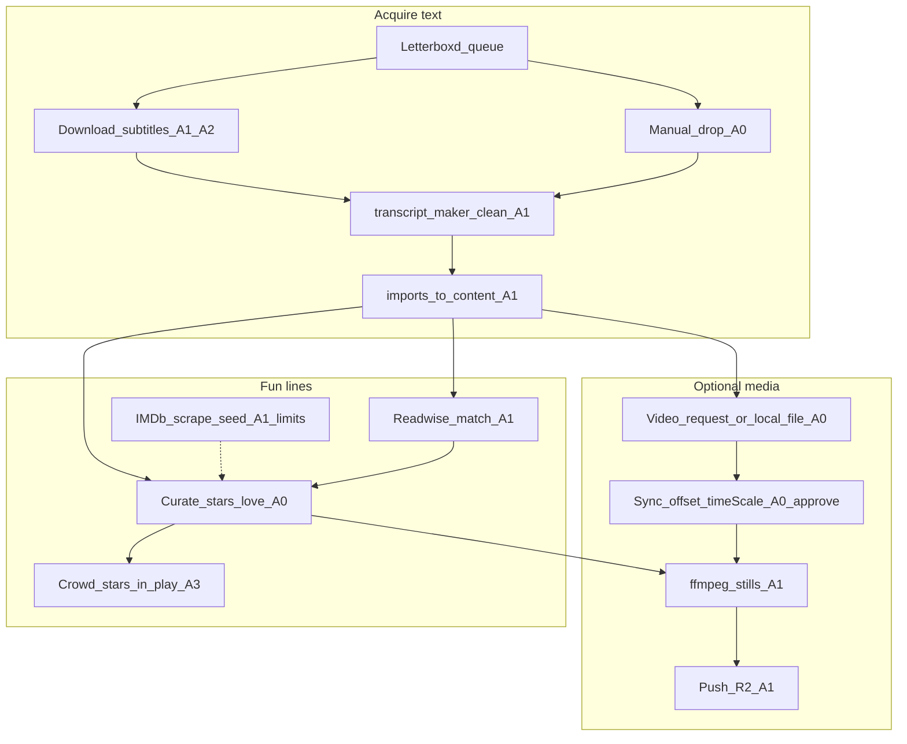
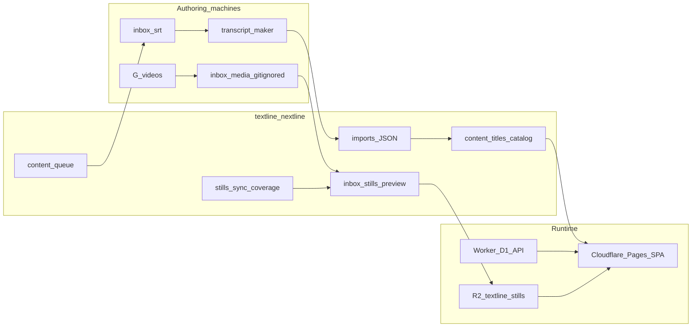
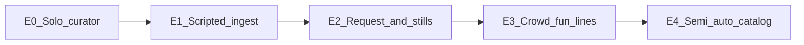
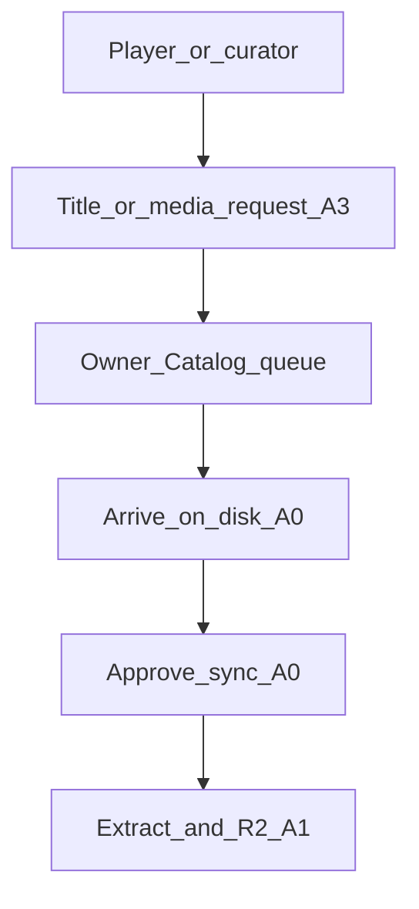
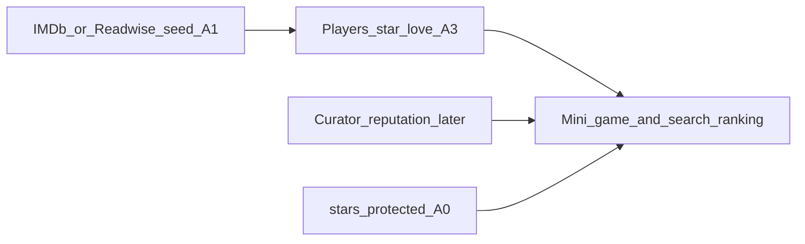
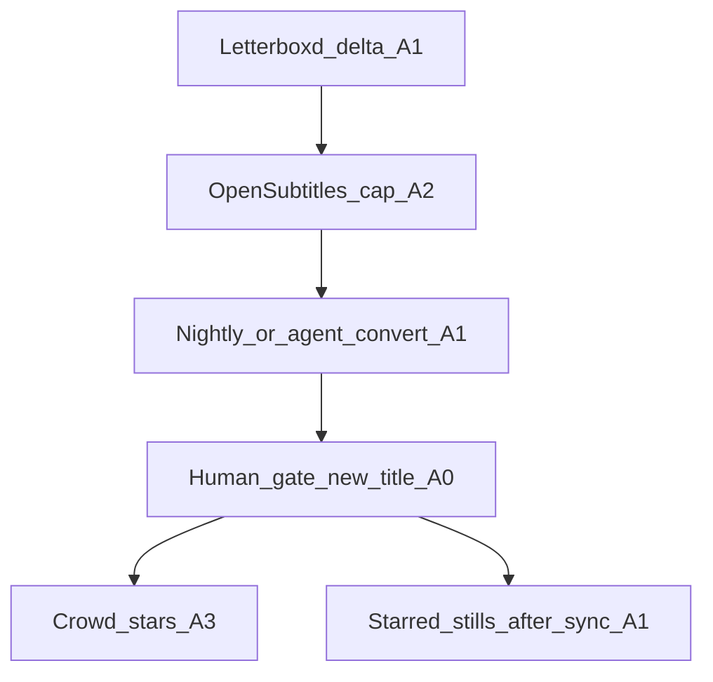

# Content pipeline: process, architecture, and scale evolutions

How titles become playable Textline → Nextline content — from subtitles and optional video through curation and stills. Companion to [ROADMAP-content.md](ROADMAP-content.md) (C0–C4 phases) and [Phase 2.6 stills](../README.md#phase-26--quote-stills-r2-catalog-ops-after-25).

**Principles**

- The **game never fetches subtitles at play time**. Players only see what is already in `content/`.
- **Crowd stars** (and later love / reputation) are how “fun lines” scale beyond one curator.
- **Video acquisition** stays mostly human; a **request system** is the product answer when automation fails.
- Each evolution adds automation where limits allow; it does not remove curator approval for sync or protected stars.

---

## Automation legend

| Level | Meaning |
|-------|---------|
| **A0 — Manual** | Human downloads, tunes, or decides; tools only assist |
| **A1 — Scripted assist** | CLI / agent skill runs the steps; human starts, reviews, or supplies files |
| **A2 — Rate-limited API** | Automated fetch with hard caps, ToS, and skip-on-failure |
| **A3 — Product loop** | In-app requests / reports / incentives; humans or jobs fulfill later |
| **Blocked** | Not automatable for us (legal, DRM, no API) — design around it |

---

## Today: end-to-end process

### Step table (today)

| Step | What happens | Automation | Limits |
|------|----------------|------------|--------|
| Seed queue | Letterboxd ZIP → likes ∪ 4.5★ → `content/queue.*` | **A1** | Export ZIP only; no Letterboxd API |
| Get subtitles | Manual drop into `inbox/srt/`, or OpenSubtitles via transcript_maker proxy | **A0 / A2** | ~20 OS downloads/day; match quality varies; no scraping random sites |
| Clean → timed JSON | transcript_maker batch / UI | **A1** | Junk SDH still needs spot-check; title naming hygiene |
| Import catalog | `npm run import:all` → `content/titles` + catalog | **A1** | Never remint protected `titleId`s / star indices |
| Download video | Local disk (`G:\videos\…`) or future request queue | **A0 / Blocked** | No reliable legal auto-download of theatrical files |
| Sync cues ↔ picture | Stills Studio / `stills-sync.json` offset + PAL `timeScale` | **A0** | Manual tune + approval before batch extract |
| Extract stills | ffmpeg at starred `startMs`; preview then R2 | **A1** | Needs remux for some encodes; only after sync OK |
| Curate fun lines | Curate UI stars / ♥ love; Readwise seed push | **A0 / A1** | One curator does not scale; protect curated titles |
| Seed from IMDb | Scrape / import memorable quotes → match to cues | **A1** | Fragile HTML; ToS; fuzzy match only → review |
| Crowd curation | Players star/love in Play / Curate | **A3** | Need incentives so stars ≠ noise |

---

## Today: architecture

| Layer | Role |
|-------|------|
| **transcript_maker** | Parse/clean SRT/VTT/`.sub`; optional OpenSubtitles; timed JSON |
| **textline-nextline content/** | Catalog, queue, sync metadata, protected stars |
| **Local media** | Remux + stills preview (gitignored); never commit video |
| **Worker + D1** | Stars, love, runs, shares — crowd signal |
| **R2 + Pages Function** | Serve confirmed stills in prod |

---

## Scale evolutions

Each generation keeps the same product contract (static catalog at play time) and raises how much of the pipeline is scripted, requested, or crowd-fed.

### E0 — Solo curator *(baseline)*

Hand-pick titles, hand-drop SRTs, convert one-by-one, star lines while watching, extract a handful of stills.

| Automation | Mostly **A0** |
| Capacity | Tens of titles / year |
| Architecture | Same boxes; ops are chat + filesystem |

### E1 — Scripted ingest *(largely here)*

Letterboxd queue, batch convert, import:all, Readwise → stars-seed, content-ingest skill.

| Automation | **A1** + optional **A2** subtitles |
| Capacity | Queue-driven movies + shows |
| Gap vs E0 | Less typing; still human for video and “is this fun?” |

**Work items E0 → E1** *(mostly done — see C0–C3)*

- [x] Letterboxd ZIP → seed queue
- [x] Batch SRT/VTT/`.sub` → timed JSON
- [x] Import + protect curated stars
- [x] Readwise match / stars-push
- [ ] Finish C2: paced OpenSubtitles fill for queue gaps
- [ ] Title meta hygiene (`year`, `tmdbId`, strip `.en` safely)

### E2 — Request system + stills loop

Assume **video download stays A0 / Blocked**. Product and ops treat “I have / want this file” as a first-class queue. Sync stays approve-gated; extract/push stay A1.

| Automation | Requests **A3**; fulfillment **A0→A1** |
| Capacity | Stills for titles you already own; backlog visible |
| Limits | Cannot auto-pull Blu-rays; remux/PAL still per-title |

**Work items E1 → E2**

- [ ] **Media / title request** — player or curator asks for a title (or “I have the file”); owner Catalog lists open requests
- [ ] Tie requests to queue + `uploads.md` / disk match (already partial)
- [ ] Line / still feedback queue (wrong still, need still, split line) — parked in README
- [ ] Stills Studio defaults + batch “approved sync → extract starred” playbook (skill exists; harden UX)
- [ ] Coverage badges: text-only vs stills-ready in Catalog

### E3 — Crowd-sourced fun lines

Curator stops being the only star source. Incentives + light moderation so popular lines are good quiz material. IMDb (or similar) is a **seed**, not ground truth.

| Automation | Play path **A3**; seeds **A1** |
| Capacity | Fun-line density grows with DAU |
| Limits | Cold start; spam stars; need love / reputation / streak bias |

**Work items E2 → E3**

- [ ] **Incentives** — surface “your stars power mini-games / search Popular”; optional curator score (parked)
- [ ] IMDb memorable-quotes scrape → fuzzy match → Curate review queue (not auto-star)
- [ ] Protect / claim flows so crowd cannot overwrite golden curator sets
- [ ] Star-streak bias + popular-line room (roadmap) so crowd stars feel good in play
- [ ] Watch-list connect (Letterboxd/Trakt) → “request this” (feeds E2)

### E4 — Semi-auto catalog at scale

More of C2–C4 on rails: re-export Letterboxd, auto-convert delta SRTs, request fulfillment SLAs, stills only for starred+approved. Optional later: Worker search FTS when client index hurts; never runtime subtitle fetch for play.

| Automation | **A1–A2** for text; **A0** gate; stills after sync |
| Capacity | Steady drip of queue titles |
| Limits | Same video/legal ceiling; quality gate stays human |

**Work items E3 → E4**

- [ ] C4: re-export Letterboxd → convert only the delta
- [ ] Dashboard: queue status (no SRT / SRT only / synced / on R2)
- [ ] Agent or cron: convert + import dry-run PR for new titles
- [ ] Cap OpenSubtitles + backoff; never scrape banned sources
- [ ] Revisit client search → Worker FTS if catalog outgrows the bundle

---

## What we will not automate (intentionally)

| Concern | Why | Instead |
|---------|-----|---------|
| Theatrical / stream rip download | Legal + DRM + brittle | Request + local disk |
| Blind stills without sync approval | Wrong frame destroys trust | Stills Studio approve |
| Runtime OpenSubtitles in the game | Latency, ToS, empty play | Pre-ingest only |
| Auto-star every IMDb quote | Bad quiz lines | Seed → human/crowd confirm |
| Reminting `line.index` on re-clean | Breaks stars/shares/stills | Overlay split / protect |

---

## Related docs

- [ROADMAP-content.md](ROADMAP-content.md) — C0–C4 content phases
- [README Phase 2.6](../README.md#phase-26--quote-stills-r2-catalog-ops-after-25) — stills / R2
- [README Line / still feedback](../README.md#line--still-feedback) — crowd report queue
- Skills: [content-ingest](../.cursor/skills/content-ingest/SKILL.md), [stills-extract](../.cursor/skills/stills-extract/SKILL.md)
