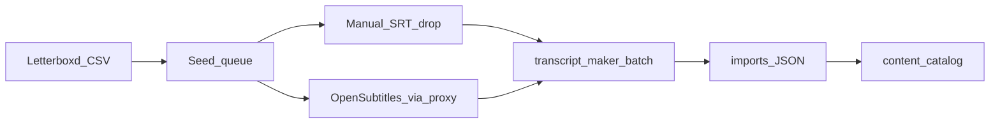

# Content workstream

Grow the playable library in parallel with app phases (1.7 admin, 2 multiplayer, 3 social, …). The game still does **not** fetch subtitles at play time. This workstream is how titles get into `content/`.

Today the catalog is Simpsons Season 4 (22 episodes) plus a hidden sample — **zero movies**. The next seed is movies you have seen and liked most, not every film.

Full pipeline (C0 is implemented later; C1 lives in the sibling repo):

```
Letterboxd CSV → seed queue → SRT (manual drop or OpenSubtitles) → transcript_maker batch → imports/ JSON → content/catalog
```



---

## Seed rule

Queue = **union of liked films and ratings ≥ 4.5**, deduped by Letterboxd URI.

| Source | File in the official export ZIP | Keep |
|--------|---------------------------------|------|
| Likes (hearts) | `likes/films.csv` | All rows |
| High ratings | `ratings.csv` | `Rating >= 4.5` (5-star scale) |

Not the full watched list. Letterboxd has no public API we will use; the official ZIP from [Export your data](https://letterboxd.com/user/exportdata/) is the source. CSV columns are `Name`, `Year`, `Letterboxd URI`, and (on ratings) `Rating` — **not TMDB ids**. Resolve those later via movie search (`Name` + `Year`).

---

## What already exists

- **Handoff:** transcript_maker timed JSON → [`imports/`](../imports/) → `npm run import:all` ([`scripts/import.ts`](../scripts/import.ts)).
- **Converter:** parse / clean / `workToTimedJson` stay in **transcript_maker** (`../transcript_maker`). Do not migrate that logic here. Batch CLI is specified in [PROMPT-transcript-maker-batch-export.md](PROMPT-transcript-maker-batch-export.md).
- **Find film:** TMDB + OpenSubtitles already work in transcript_maker’s browser UI (local Cloudflare proxy, ~20 OpenSubtitles downloads/day). Scraping other subtitle sites is out of scope.
- **Letterboxd queue:** not built yet. Implementation prompt: [PROMPT-letterboxd-queue.md](PROMPT-letterboxd-queue.md).

---

## Repo split

| Concern | Lives in |
|---------|----------|
| Letterboxd ZIP → queue, import JSON, catalog | **textline-nextline** |
| Parse / clean / timed JSON, optional OpenSubtitles download by `tmdb_id` | **transcript_maker** |

---

## Phases (C0–C4)

Run these beside app work. Nothing here blocks rooms, stars, or auth.

### C0 — Seed queue *(this repo)*

Drop the Letterboxd export ZIP into a gitignored inbox. Script (not written yet):

1. Parse `likes/films.csv` ∪ `ratings.csv` (`Rating >= 4.5`).
2. Dedupe by Letterboxd URI.
3. Write a tracked queue (`title`, `year`, `letterboxdUri`, `tmdbId?`, `srt`, `converted`, `imported`).
4. Resolve TMDB id via existing movie search (`Name` + `Year`).

**Done when:** a queue JSON lists the seed set and can be re-run against a newer export without wiping status on titles already converted.

Copy-paste prompt: [PROMPT-letterboxd-queue.md](PROMPT-letterboxd-queue.md).

### C1 — Batch convert *(transcript_maker)*

Add `npm run batch:export` in transcript_maker. Process a folder of `.srt` / `.vtt`, generate transcripts with default clean options, write timed JSON to `../textline-nextline/imports/`.

Titles for movies should be **name + year** (e.g. `The Great Escape (1963)`), not TV-style `Show - 4x01 - Name`. Strip language suffixes (`.en`) from titles. Do **not** download SRTs in this step.

**Done when:** a folder of movie SRTs exports JSON that `npm run import:all` ingests without errors.

Copy-paste prompt: [PROMPT-transcript-maker-batch-export.md](PROMPT-transcript-maker-batch-export.md). Run it in a Cursor chat whose workspace is `../transcript_maker`.

### C2 — SRT acquisition *(hybrid)*

Manual drop is first-class: put `.srt` / `.vtt` in an inbox folder and run C1.

Optional: paced OpenSubtitles download through transcript_maker’s existing proxy (respect the daily cap; skip failures; match by `tmdb_id` from C0). Do not scrape tvsubtitles.net or similar.

**Done when:** you can fill the queue either by dropping files or by a rate-limited API path, then convert.

### C3 — Import + movie catalog hygiene *(this repo)*

Existing `npm run import:all` is enough to publish. Follow-on:

- Persist `year` and `tmdbId` on `TitleMeta` ([`src/types/content.ts`](../src/types/content.ts)) when the export or queue provides them.
- Stop `.en` leaking into titles/ids (Simpsons imports already have this).

**Done when:** a converted movie shows a clean title + year in the library picker.

### C4 — Ongoing

Re-drop a fresh Letterboxd export, diff the queue, convert only the delta. Spot-check watermarks / SDH before publishing to `content/`.

**Done when:** adding a newly liked or 4.5★ film is a repeatable delta, not a full rebuild.

---

## Legal / git

- Personal curated library only. Not every movie.
- Gitignore the Letterboxd ZIP, SRT inbox, and any OpenSubtitles download cache. Keep committing normalized `content/` JSON the same way Simpsons is stored today.
- OpenSubtitles stays TOS-compliant API use via the existing proxy — not a public relay.
- Subtitles/transcripts may be copyrighted; treat the catalog as content you prepared for this personal game.

---

## Suggested order

1. Document (this file) — **now**.
2. C1 in transcript_maker (batch export) — unblocks any SRT you already have, including more TV.
3. C0 Letterboxd queue in this repo — turns likes ∪ 4.5★ into a checklist.
4. C2 as needed (manual first; OpenSubtitles when the queue is large).
5. C3 hygiene when the first movies land in `content/`.
6. C4 whenever you export Letterboxd again.
