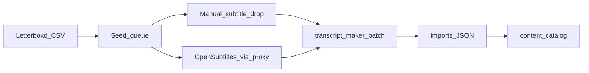

# Content workstream

Grow the playable library in parallel with app phases (1.8 library browse, 2a auth, 2.5 reputation, 2.6 stills / catalog ops, 2 rooms, …). The game still does **not** fetch subtitles at play time. This workstream is how titles get into `content/`.

Process diagrams, automation levels, and scale evolutions (E0–E4): [CONTENT-PIPELINE.md](CONTENT-PIPELINE.md).

**Today:** Tier-1 movies plus Simpsons Seasons 4–5 (and a hidden sample) are already in `content/`. Sep 2026 ingest added Back to the Future 1–3, Gone in 60 Seconds, Goodfellas, O Brother, 40 Year Old Virgin, and Lebowski (Dune skipped — incomplete SRT). The Letterboxd likes ∪ 4.5★ queue tracks what to convert next — not every film.

Full pipeline:

```
Letterboxd CSV → seed queue → SRT/VTT/.sub (manual drop or OpenSubtitles) → transcript_maker batch → imports/ JSON → content/catalog
```



Agent skill for ingest: [`.cursor/skills/content-ingest/SKILL.md`](../.cursor/skills/content-ingest/SKILL.md).

---

## Seed rule

Queue = **union of liked films and ratings ≥ 4.5**, deduped by Letterboxd URI.

| Source | File in the official export ZIP | Keep |
|--------|---------------------------------|------|
| Likes (hearts) | `likes/films.csv` | All rows |
| High ratings | `ratings.csv` | `Rating >= 4.5` (5-star scale) |

Not the full watched list. Letterboxd has no public API we will use; the official ZIP from [Export your data](https://letterboxd.com/user/exportdata/) is the source. CSV columns are `Name`, `Year`, `Letterboxd URI`, and (on ratings) `Rating` — **not TMDB ids**. Resolve those later via movie search (`Name` + `Year`).

---

## What already exists

- **Handoff:** transcript_maker timed JSON → [`imports/`](../imports/) → `npm run import:all` ([`scripts/import.ts`](../scripts/import.ts)).
- **Converter:** parse / clean / `workToTimedJson` stay in **transcript_maker** (`../transcript_maker`). Do not migrate that logic here. Batch CLI accepts `.srt` / `.vtt` / `.sub` (SubViewer 2.0). Spec: [PROMPT-transcript-maker-batch-export.md](PROMPT-transcript-maker-batch-export.md).
- **Find film:** TMDB + OpenSubtitles already work in transcript_maker’s browser UI (local Cloudflare proxy, ~20 OpenSubtitles downloads/day). Scraping other subtitle sites is out of scope.
- **Letterboxd queue:** `npm run content:queue -- --from <zip-or-dir> [--vault <readwise-dir>]` writes `content/queue.json` + `content/queue.md` (sort: priority → diary plays → highlights). Implementation notes: [PROMPT-letterboxd-queue.md](PROMPT-letterboxd-queue.md).
- **Readwise / stars-seed:** queue with `--vault` writes `content/readwise-highlights.json` and fuzzy-matched `content/stars-seed.json`; push to D1 via `npm run content:stars-push` (prefer `--dry-run --remote` first). Never `--force` titles in `stars-protected.json`.
- **Library browse:** import fills `meta.show` / `season` / `episode`; UI groups Movies \| TV → seasons ([`libraryGroups`](../src/lib/content/libraryGroups.ts)).

---

## Repo split

| Concern | Lives in |
|---------|----------|
| Letterboxd ZIP → queue, import JSON, catalog | **textline-nextline** |
| Parse / clean / timed JSON (SRT, VTT, SubViewer `.sub`), optional OpenSubtitles download by `tmdb_id` | **transcript_maker** |

---

## Phases (C0–C4)

Run these beside app work. Nothing here blocks rooms, stars, or auth.

### C0 — Seed queue *(this repo)* ✅

Drop the Letterboxd export ZIP into `inbox/letterboxd/` (gitignored). Then:

```bash
npm run content:queue -- --from inbox/letterboxd/<export>.zip
```

The script:

1. Parses `likes/films.csv` ∪ `ratings.csv` (`Rating >= 4.5`).
2. Dedupes by Letterboxd URI.
3. Counts **plays** from `diary.csv` (each log, including rewatches).
4. Optional `--vault`: scan Readwise/Obsidian notes, match titles to the queue, count highlights.
5. Writes the queue sorted in `queue.md` by priority, then play count, then highlight count.
6. Writes `content/readwise-highlights.json` and, for titles already in `content/titles/`, `content/stars-seed.json` (fuzzy-matched line indices). Apply seed with `content:stars-push`.

TMDB ids stay `null` until a later resolve step.

**Done when:** a queue JSON lists the seed set and can be re-run against a newer export without wiping status on titles already converted. ✅

Copy-paste prompt: [PROMPT-letterboxd-queue.md](PROMPT-letterboxd-queue.md).

### C1 — Batch convert *(transcript_maker)* ✅

`npm run batch:export` in transcript_maker. Process a folder of `.srt` / `.vtt` / `.sub`, generate transcripts with default clean options, write timed JSON to `../textline-nextline/imports/`.

Titles for movies should be **name + year** (e.g. `The Great Escape (1963)`), not TV-style `Show - 4x01 - Name`. Strip language suffixes (`.en`) from titles. Do **not** download SRTs in this step.

**Done when:** a folder of movie SRTs exports JSON that `npm run import:all` ingests without errors. ✅

Copy-paste prompt: [PROMPT-transcript-maker-batch-export.md](PROMPT-transcript-maker-batch-export.md). Run it in a Cursor chat whose workspace is `../transcript_maker`.

### C1.5 — SubViewer (.sub) *(transcript_maker)* ✅

Simpsons S5 (and similar packs) ship as SubViewer 2.0 (`.sub`), not SRT. Parser handles timestamps + `[br]` line breaks; batch-export and UI accept `.sub`. S5 is imported into `content/`.

**Done when:** `.sub` files convert the same way as `.srt`. ✅

### C2 — Subtitle acquisition *(hybrid)*

Manual drop is first-class: put `.srt` / `.vtt` / `.sub` in `inbox/srt/` and convert with C1.

Optional: paced OpenSubtitles download through transcript_maker’s existing proxy (respect the daily cap; skip failures; match by `tmdb_id` from C0). Do not scrape tvsubtitles.net or similar.

**Done when:** you can fill the queue either by dropping files or by a rate-limited API path, then convert.

### C3 — Import + movie catalog hygiene *(this repo)* 🔄

Existing `npm run import:all` is enough to publish. Movies and S4/S5 are already playable. Sep 2026 delta (2.6 branch): Back to the Future 1–3, Gone in 60 Seconds, Goodfellas, O Brother, 40 Year Old Virgin, Lebowski. Follow-on:

- Persist `year` and `tmdbId` on `TitleMeta` ([`src/types/content.ts`](../src/types/content.ts)) when the export or queue provides them.
- Stop `.en` leaking into titles/ids (Simpsons S4 imports still have this). Prefer cleaning without rewriting star `titleId`s carelessly.
- Never re-import titles in [`content/stars-protected.json`](../content/stars-protected.json). Seed-push skips those even with `--force`, and skips any title that already has live D1 stars.

**Done when:** converted titles show clean name + year in the library picker, and legacy `.en` tails are gone safely.

### C4 — Ongoing

Re-drop a fresh Letterboxd export, diff the queue, convert only the delta. Spot-check watermarks / SDH before publishing to `content/`.

**Done when:** adding a newly liked or 4.5★ film is a repeatable delta, not a full rebuild.

---

## Legal / git

- Personal curated library only. Not every movie.
- Gitignore the Letterboxd ZIP, SRT inbox, and any OpenSubtitles download cache. Keep committing normalized `content/` JSON the same way Simpsons is stored today.
- OpenSubtitles stays TOS-compliant API use via the existing proxy — not a public relay.
- Subtitles/transcripts may be copyrighted; treat the catalog as content you prepared for this personal game.

---

## Suggested order

1. Document (this file) — **done**; keep in sync with catalog growth.
2. C1 / C1.5 in transcript_maker — **done** (batch + `.sub`).
3. C0 Letterboxd queue in this repo — **done**; re-run when you export Letterboxd again.
4. C2 as needed (manual first; OpenSubtitles when the queue is large).
5. C3 hygiene (`.en` tails, TMDB ids) — **next content polish**.
6. C4 whenever you export Letterboxd again.

App home / “top played” rails are live on the library Home landing — see Phase 2.5 in the main README. Quote stills, R2, and owner Catalog are Phase 2.6.
